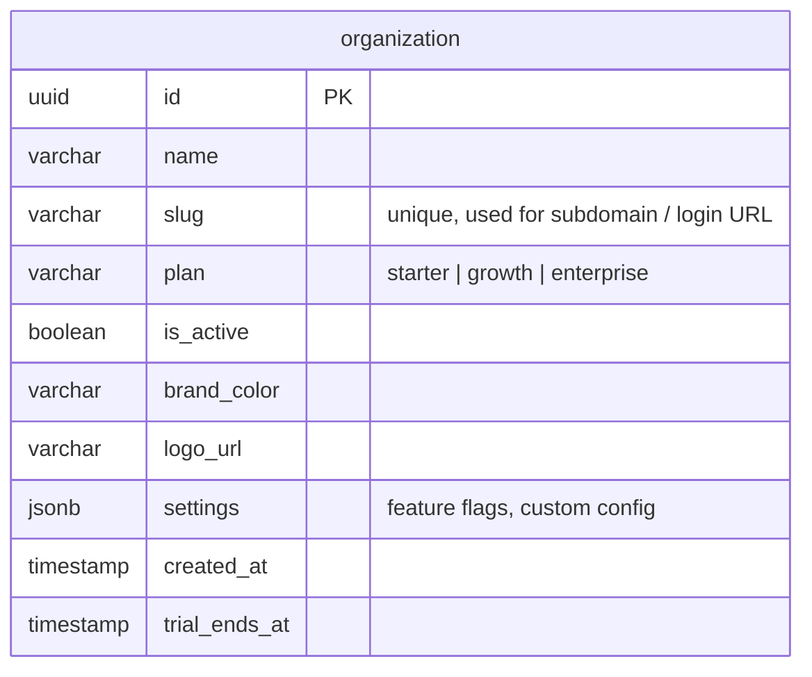
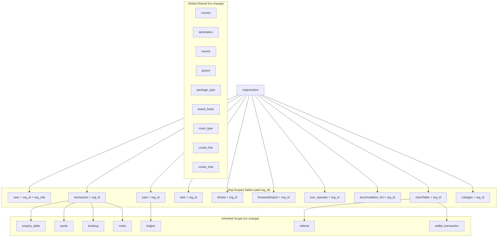
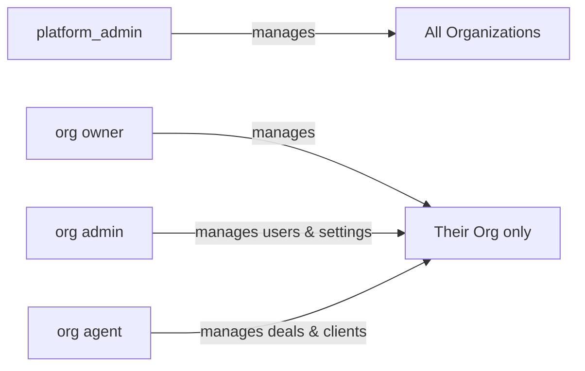
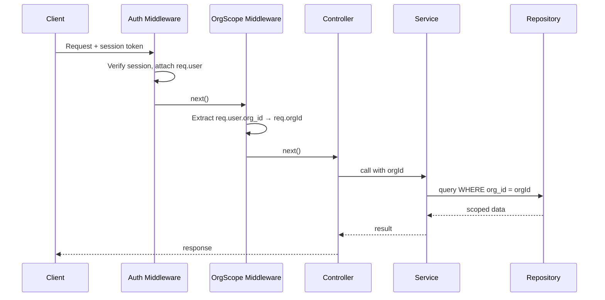
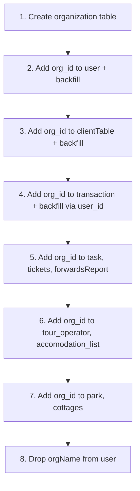
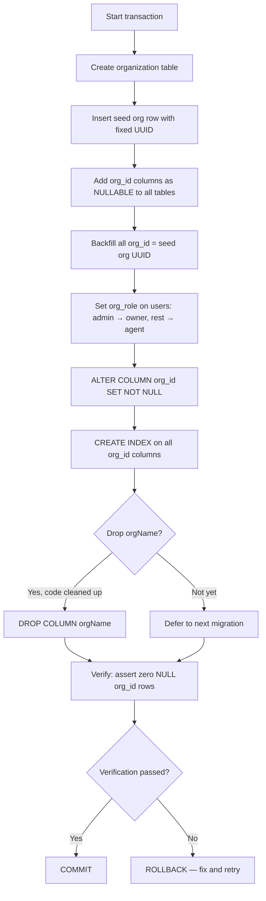

# SaaS Multi-Tenancy Plan

## Overview

The goal is to introduce an **Organization** as the top-level tenant. Every travel agency that signs up
becomes one Organization. Users, clients, and all operational data belong to exactly one Organization.
Shared reference data (countries, destinations, airports, etc.) stays global.

---

## 1. New Table: `organization`

This is the root tenant entity. Everything else hangs off it.



---

## 2. Tables That Get `org_id`

### Tier 1 — Add `org_id` directly (primary scoping columns)

These are tables where every row is strictly owned by one org. They need a direct FK for efficient queries.

```mermaid
erDiagram
    organization ||--o{ user : "has many"
    organization ||--o{ clientTable : "has many"
    organization ||--o{ transaction : "has many"
    organization ||--o{ task : "has many"
    organization ||--o{ tickets : "has many"
    organization ||--o{ forwardsReport : "has many"
    organization ||--o{ tour_operator : "has many"
    organization ||--o{ accomodation_list : "has many"
    organization ||--o{ park : "has many"
    organization ||--o{ cottages : "has many"

    user {
        text   id PK
        uuid   org_id FK "NEW — replaces orgName text field"
        text   org_role "NEW — owner | admin | agent"
        text   name
        text   email
        text   role "kept for app-level role (admin, agent)"
    }

    clientTable {
        uuid   id PK
        uuid   org_id FK "NEW"
        varchar firstName
        varchar surename
    }

    transaction {
        uuid   id PK
        uuid   org_id FK "NEW — denormalised for fast scoping"
        text   user_id FK
        uuid   client_id FK
    }

    task {
        uuid   id PK
        uuid   org_id FK "NEW"
        text   agent_id FK
    }

    tickets {
        varchar id PK
        uuid    org_id FK "NEW"
        text    userId FK
    }

    forwardsReport {
        uuid    id PK
        uuid    org_id FK "NEW"
        integer month
        integer year
    }

    tour_operator {
        uuid    id PK
        uuid    org_id FK "NEW — each org manages their own operators"
        varchar name
    }

    accomodation_list {
        uuid    id PK
        uuid    org_id FK "NEW — org-specific accommodation inventory"
        varchar name
    }

    park {
        uuid    id PK
        uuid    org_id FK "NEW"
        varchar name
    }

    cottages {
        uuid    id PK
        uuid    org_id FK "NEW"
        varchar cottage_name
    }
```



### Tier 2 — Inherited via FK (no direct `org_id` needed)

These rows belong to an org transitively. Scoping is done by joining their parent table.
No schema change required — just ensure queries join through the parent.

```mermaid
erDiagram
    transaction ||--o{ enquiry_table : "cascade"
    transaction ||--o{ quote : "cascade"
    transaction ||--o{ booking : "cascade"
    transaction ||--o{ notes : "cascade"

    quote ||--o{ travel_deal : "cascade"
    quote ||--o{ quote_flights : "cascade"
    quote ||--o{ quote_accomodation : "cascade"
    quote ||--o{ quote_transfers : "cascade"
    quote ||--o{ quote_car_hire : "cascade"
    quote ||--o{ quote_attraction_ticket : "cascade"
    quote ||--o{ quote_lounge_pass : "cascade"
    quote ||--o{ quote_airport_parking : "cascade"
    quote ||--o{ quote_cruise : "cascade"

    booking ||--o{ booking_flights : "cascade"
    booking ||--o{ booking_accomodation : "cascade"
    booking ||--o{ booking_transfers : "cascade"
    booking ||--o{ booking_car_hire : "cascade"
    booking ||--o{ booking_attraction_ticket : "cascade"
    booking ||--o{ booking_lounge_pass : "cascade"
    booking ||--o{ booking_airport_parking : "cascade"
    booking ||--o{ booking_cruise : "cascade"

    park ||--o{ lodges : "cascade"

    clientTable ||--o{ referral : "cascade"
    clientTable ||--o{ referral_payout : "cascade"
    clientTable ||--o{ referral_withdrawal : "cascade"
    clientTable ||--o{ wallet_transaction : "cascade"
```



### Tier 3 — Global Shared (no `org_id`, no change)

These are master reference tables shared by all organisations. Managed by the platform admin.

```mermaid
erDiagram
    country ||--o{ destination : "has many"
    destination ||--o{ resorts : "has many"
    country ||--o{ airport : "has many"
    package_type ||--o{ tour_package_commission : "has many"

    country { uuid id PK; varchar country_name }
    destination { uuid id PK; uuid country_id FK; varchar name }
    resorts { uuid id PK; uuid destination_id FK; varchar name }
    airport { uuid id PK; uuid country_id FK; varchar airport_code }
    package_type { uuid id PK; varchar name }
    board_basis { uuid id PK; varchar type }
    room_type { uuid id PK; varchar name }
    cruise_line { uuid id PK; varchar name }
    cruise_ship { uuid id PK; uuid cruise_line_id FK; varchar name }
    cruise_itenary { uuid id PK; uuid ship_id FK; date date }
```

---

## 3. Full Tenancy Map



---

## 4. User Roles Per Org

Replace the current flat `role` text field with a two-level system:

| Field | Values | Purpose |
|-------|--------|---------|
| `org_role` | `owner`, `admin`, `agent` | Controls what the user can do inside their org |
| `role` | `platform_admin`, `user` | Controls platform-level access (super admin vs normal) |



---

## 5. Backend Middleware Changes

### Current flow
```
Request → Auth → Controller → Service → Repository
```

### New flow
```
Request → Auth → OrgScope → Controller → Service → Repository(orgId)
```

The `OrgScope` middleware:
1. Reads the authenticated user's `org_id` from the session/JWT
2. Attaches it to `req.orgId`
3. Rejects requests from users with no `org_id` (unless they are `platform_admin`)



---

## 6. Route Scoping Strategy

| Route group | Scoping | Change needed |
|-------------|---------|---------------|
| `/api/lookup/*` (countries, destinations, airports, board-basis, room-types, cruise-*) | **Global** | None — these serve shared reference data |
| `/api/lookup/accommodations` | **Org-scoped** | Add `WHERE org_id = ?` |
| `/api/settings/accommodation-list` | **Org-scoped** | Add `org_id` on insert/query |
| `/api/settings/tour-operators` | **Org-scoped** | Add `org_id` on insert/query |
| `/api/settings/parks`, `/api/settings/lodges`, `/api/settings/cottages` | **Org-scoped** | Add `org_id` on insert/query |
| `/api/clients`, `/api/transactions`, `/api/quotes`, `/api/bookings` | **Org-scoped** | Add `WHERE org_id = ?` |
| `/api/users` | **Org-scoped** | Users can only see users in their org |
| `/api/platform-admin/*` | **Platform admin only** | New route group, guards by `role = platform_admin` |

---

## 7. `org_id` Propagation on Insert

When creating any org-scoped record, the service layer must inject `org_id`:

```
// Example: create transaction
transactionService.create(data, orgId) {
  return transactionRepository.insert({ ...data, org_id: orgId });
}
```

Never trust `org_id` from the request body — always pull it from `req.orgId`.

---

## 8. Migration Priority Order

Run migrations in this sequence to avoid FK constraint failures:



For the initial migration (single existing org):
- Create one `organization` row for the current agency
- Backfill all `org_id` columns with that single org's id
- Then enforce `NOT NULL` on those columns

---

## 9. What Does NOT Change

- The session table (`sessions`) — stays as-is
- All lookup/reference tables: `country`, `destination`, `resorts`, `airport`, `package_type`, `board_basis`, `room_type`, `cruise_line`, `cruise_ship`, `cruise_itenary`, `cruise_voyage`, `cruise_destination`, `port`
- All cascade/join tables (`enquiry_*`, `quote_*`, `booking_*`) — scoped implicitly via their parent FK
- The referral and wallet system — scoped implicitly via `client_id → clientTable.org_id`

---

## 10. Summary of Schema Changes

| Table | Change |
|-------|--------|
| **NEW** `organization` | Create with: id, name, slug, plan, is_active, brand_color, logo_url, settings, created_at, trial_ends_at |
| `user` | Add `org_id uuid FK → organization.id`, add `org_role varchar`, drop `orgName text` |
| `clientTable` | Add `org_id uuid FK → organization.id NOT NULL` |
| `transaction` | Add `org_id uuid FK → organization.id NOT NULL` |
| `task` | Add `org_id uuid FK → organization.id NOT NULL` |
| `tickets` | Add `org_id uuid FK → organization.id NOT NULL` |
| `forwardsReport` | Add `org_id uuid FK → organization.id NOT NULL` |
| `tour_operator` | Add `org_id uuid FK → organization.id NOT NULL` |
| `accomodation_list` | Add `org_id uuid FK → organization.id NOT NULL` |
| `park` | Add `org_id uuid FK → organization.id NOT NULL` |
| `cottages` | Add `org_id uuid FK → organization.id NOT NULL` |
| `tour_package_commission` | Add `org_id` (inherits from tour_operator but denorm helps) |

---

## 11. Data Migration Script (Existing Single-Tenant → Multi-Tenant)

This script migrates the current live data. It is safe to run on an existing database — every step is
additive first, then constrains after backfilling. Run inside a single transaction so any failure rolls
back completely.

```sql
BEGIN;

-- ─── STEP 1: Create the organization table ────────────────────────────────────

CREATE TABLE IF NOT EXISTS organization (
  id             UUID PRIMARY KEY DEFAULT gen_random_uuid(),
  name           VARCHAR NOT NULL,
  slug           VARCHAR NOT NULL UNIQUE,
  plan           VARCHAR NOT NULL DEFAULT 'starter',
  is_active      BOOLEAN NOT NULL DEFAULT true,
  brand_color    VARCHAR,
  logo_url       VARCHAR,
  settings       JSONB DEFAULT '{}',
  created_at     TIMESTAMP NOT NULL DEFAULT NOW(),
  trial_ends_at  TIMESTAMP
);

-- ─── STEP 2: Seed the current agency as the first organization ────────────────
-- Replace the name/slug/brand_color values with the real agency details.

INSERT INTO organization (id, name, slug, plan, is_active, brand_color, created_at)
VALUES (
  'aaaaaaaa-0000-0000-0000-000000000001',   -- fixed UUID so we can reference it below
  'Softype Travel',                          -- ← replace with real agency name
  'softype',                                 -- ← replace with real slug
  'enterprise',
  true,
  '#3b82f6',                                 -- ← replace with real brand colour
  NOW()
);

-- Alias so all backfills below use the same value
DO $$ BEGIN
  PERFORM set_config('app.seed_org_id', 'aaaaaaaa-0000-0000-0000-000000000001', true);
END $$;

-- ─── STEP 3: Add org_id columns (nullable first, constrained after backfill) ──

ALTER TABLE "user"             ADD COLUMN IF NOT EXISTS org_id UUID REFERENCES organization(id);
ALTER TABLE "user"             ADD COLUMN IF NOT EXISTS org_role VARCHAR DEFAULT 'agent';

ALTER TABLE client_table       ADD COLUMN IF NOT EXISTS org_id UUID REFERENCES organization(id);
ALTER TABLE transaction        ADD COLUMN IF NOT EXISTS org_id UUID REFERENCES organization(id);
ALTER TABLE task                ADD COLUMN IF NOT EXISTS org_id UUID REFERENCES organization(id);
ALTER TABLE tickets             ADD COLUMN IF NOT EXISTS org_id UUID REFERENCES organization(id);
ALTER TABLE forwards_report    ADD COLUMN IF NOT EXISTS org_id UUID REFERENCES organization(id);
ALTER TABLE tour_operator_table ADD COLUMN IF NOT EXISTS org_id UUID REFERENCES organization(id);
ALTER TABLE accomodation_list_table ADD COLUMN IF NOT EXISTS org_id UUID REFERENCES organization(id);
ALTER TABLE park_table         ADD COLUMN IF NOT EXISTS org_id UUID REFERENCES organization(id);
ALTER TABLE cottages_table     ADD COLUMN IF NOT EXISTS org_id UUID REFERENCES organization(id);
ALTER TABLE tour_package_commission_table ADD COLUMN IF NOT EXISTS org_id UUID REFERENCES organization(id);

-- ─── STEP 4: Backfill all org_id columns with the seed org ───────────────────

UPDATE "user"                      SET org_id = current_setting('app.seed_org_id')::uuid WHERE org_id IS NULL;
UPDATE client_table                SET org_id = current_setting('app.seed_org_id')::uuid WHERE org_id IS NULL;
UPDATE transaction                 SET org_id = current_setting('app.seed_org_id')::uuid WHERE org_id IS NULL;
UPDATE task                         SET org_id = current_setting('app.seed_org_id')::uuid WHERE org_id IS NULL;
UPDATE tickets                     SET org_id = current_setting('app.seed_org_id')::uuid WHERE org_id IS NULL;
UPDATE forwards_report             SET org_id = current_setting('app.seed_org_id')::uuid WHERE org_id IS NULL;
UPDATE tour_operator_table         SET org_id = current_setting('app.seed_org_id')::uuid WHERE org_id IS NULL;
UPDATE accomodation_list_table     SET org_id = current_setting('app.seed_org_id')::uuid WHERE org_id IS NULL;
UPDATE park_table                  SET org_id = current_setting('app.seed_org_id')::uuid WHERE org_id IS NULL;
UPDATE cottages_table              SET org_id = current_setting('app.seed_org_id')::uuid WHERE org_id IS NULL;
UPDATE tour_package_commission_table SET org_id = current_setting('app.seed_org_id')::uuid WHERE org_id IS NULL;

-- ─── STEP 5: Backfill org_role for existing users ────────────────────────────
-- Users whose current role is 'admin' become org owners; everyone else is 'agent'.

UPDATE "user"
SET org_role = CASE
  WHEN role = 'admin' THEN 'owner'
  ELSE 'agent'
END
WHERE org_role IS NULL OR org_role = 'agent';

-- ─── STEP 6: Enforce NOT NULL now that every row is backfilled ───────────────

ALTER TABLE "user"                       ALTER COLUMN org_id SET NOT NULL;
ALTER TABLE client_table                 ALTER COLUMN org_id SET NOT NULL;
ALTER TABLE transaction                  ALTER COLUMN org_id SET NOT NULL;
ALTER TABLE task                          ALTER COLUMN org_id SET NOT NULL;
ALTER TABLE tickets                      ALTER COLUMN org_id SET NOT NULL;
ALTER TABLE forwards_report              ALTER COLUMN org_id SET NOT NULL;
ALTER TABLE tour_operator_table          ALTER COLUMN org_id SET NOT NULL;
ALTER TABLE accomodation_list_table      ALTER COLUMN org_id SET NOT NULL;
ALTER TABLE park_table                   ALTER COLUMN org_id SET NOT NULL;
ALTER TABLE cottages_table               ALTER COLUMN org_id SET NOT NULL;
ALTER TABLE tour_package_commission_table ALTER COLUMN org_id SET NOT NULL;

-- ─── STEP 7: Add indexes for all new org_id columns ──────────────────────────
-- These are critical — every scoped query WHERE org_id = ? will hit these.

CREATE INDEX IF NOT EXISTS idx_user_org_id              ON "user"(org_id);
CREATE INDEX IF NOT EXISTS idx_client_org_id            ON client_table(org_id);
CREATE INDEX IF NOT EXISTS idx_transaction_org_id       ON transaction(org_id);
CREATE INDEX IF NOT EXISTS idx_task_org_id               ON task(org_id);
CREATE INDEX IF NOT EXISTS idx_tickets_org_id           ON tickets(org_id);
CREATE INDEX IF NOT EXISTS idx_forwards_report_org_id   ON forwards_report(org_id);
CREATE INDEX IF NOT EXISTS idx_tour_operator_org_id     ON tour_operator_table(org_id);
CREATE INDEX IF NOT EXISTS idx_accom_list_org_id        ON accomodation_list_table(org_id);
CREATE INDEX IF NOT EXISTS idx_park_org_id              ON park_table(org_id);
CREATE INDEX IF NOT EXISTS idx_cottages_org_id          ON cottages_table(org_id);

-- ─── STEP 8: Drop the now-redundant orgName text column from user ─────────────
-- Only safe once org_id is the source of truth. Skip this step if any
-- application code still reads orgName — remove those references first.

ALTER TABLE "user" DROP COLUMN IF EXISTS "orgName";

-- ─── STEP 9: Verify — every table should have zero NULL org_id rows ──────────

DO $$
DECLARE
  bad_count INTEGER;
BEGIN
  SELECT COUNT(*) INTO bad_count FROM "user"                   WHERE org_id IS NULL;
  IF bad_count > 0 THEN RAISE EXCEPTION 'user has % rows with NULL org_id', bad_count; END IF;

  SELECT COUNT(*) INTO bad_count FROM client_table             WHERE org_id IS NULL;
  IF bad_count > 0 THEN RAISE EXCEPTION 'client_table has % rows with NULL org_id', bad_count; END IF;

  SELECT COUNT(*) INTO bad_count FROM transaction              WHERE org_id IS NULL;
  IF bad_count > 0 THEN RAISE EXCEPTION 'transaction has % rows with NULL org_id', bad_count; END IF;

  SELECT COUNT(*) INTO bad_count FROM task                      WHERE org_id IS NULL;
  IF bad_count > 0 THEN RAISE EXCEPTION 'task has % rows with NULL org_id', bad_count; END IF;

  SELECT COUNT(*) INTO bad_count FROM tickets                  WHERE org_id IS NULL;
  IF bad_count > 0 THEN RAISE EXCEPTION 'tickets has % rows with NULL org_id', bad_count; END IF;

  SELECT COUNT(*) INTO bad_count FROM tour_operator_table      WHERE org_id IS NULL;
  IF bad_count > 0 THEN RAISE EXCEPTION 'tour_operator_table has % rows with NULL org_id', bad_count; END IF;

  SELECT COUNT(*) INTO bad_count FROM accomodation_list_table  WHERE org_id IS NULL;
  IF bad_count > 0 THEN RAISE EXCEPTION 'accomodation_list_table has % rows with NULL org_id', bad_count; END IF;

  RAISE NOTICE 'Migration verification passed — all tables fully backfilled.';
END $$;

COMMIT;
```

> **Before running in production:**
> 1. Run against a staging copy of the database first.
> 2. Replace `'Softype Travel'`, `'softype'`, and the brand colour with the real values.
> 3. Step 8 (drop `orgName`) can be deferred to a follow-up migration once you have confirmed no code reads it.
> 4. Take a full database backup immediately before executing.

---

## 12. Migration Flow Diagram


