# SaaS Multi-Tenancy Plan

## Overview

The goal is to introduce an **Organization** as the top-level tenant, with **Branches** as
subdivisions within it. Every travel agency that signs up becomes one Organization. They can then
create one or more Branches (offices, teams, virtual groups). Users belong to a Branch.

**Critical design rule:**
> All data is bound to `org_id`. This is the true tenant isolation boundary — every security
> filter, every query, every insert is scoped by `org_id` first and always.
> `branch_id` on data rows is a **grouping and reporting dimension only** — it records which branch
> created or manages the record, and is used to filter views for branch managers. It is NOT a hard
> ownership lock. Data belongs to the org; branches are just labels.

This is how real SaaS platforms work: Salesforce data belongs to the account (territories are
filters), HubSpot contacts belong to the portal (teams are filters), Freshdesk tickets belong to
the account (groups are filters). The branch can change on a record without breaking data access.

Shared reference data (countries, destinations, airports, etc.) stays global.

```
Platform (Travana)
 └── Organization  ("XYZ Travel Ltd")
      ├── Branch A  ("Manchester Office")
      │    ├── Branch Manager
      │    ├── Agent
      │    └── Agent
      ├── Branch B  ("London Office")
      │    ├── Branch Manager
      │    └── Agent
      └── Branch C  ("Online / Homeworkers")
           └── Homeworker
```

---

## 1. New Tables

### `organization`

The root tenant entity. Everything else hangs off it.

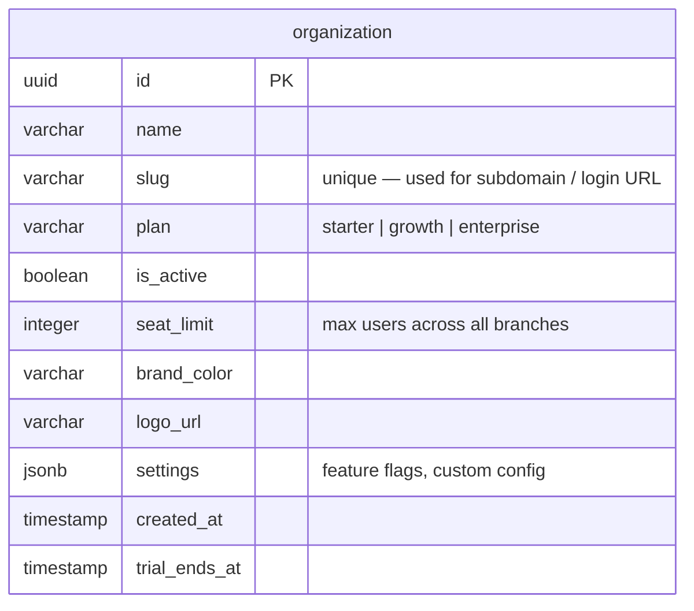
```mermaid
erDiagram
    organization {
        uuid      id PK
        varchar   name
        varchar   slug             "unique — used for subdomain / login URL"
        varchar   plan             "starter | growth | enterprise"
        boolean   is_active
        integer   seat_limit       "max users across all branches"
        varchar   brand_color
        varchar   logo_url
        jsonb     settings         "feature flags, custom config"
        timestamp created_at
        timestamp trial_ends_at
    }
```

### `branches`

A subdivision of an organization — an office, team, or virtual group.

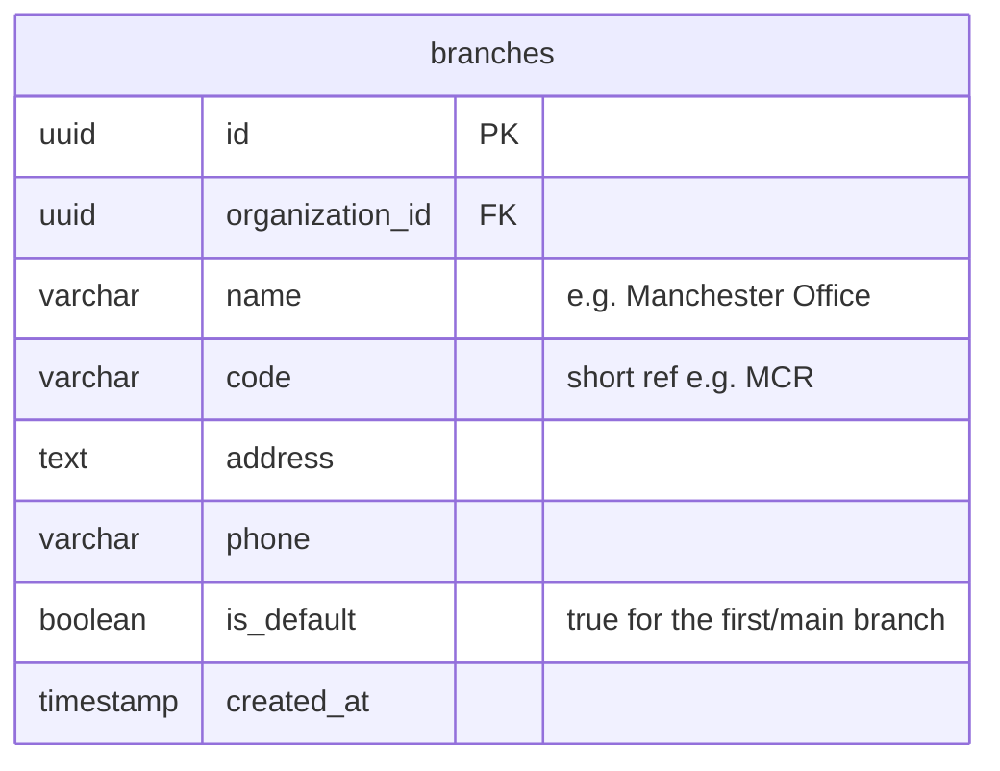
```mermaid
erDiagram
    branches {
        uuid      id PK
        uuid      organization_id FK
        varchar   name             "e.g. Manchester Office"
        varchar   code             "short ref e.g. MCR"
        text      address
        varchar   phone
        boolean   is_default       "true for the first/main branch"
        timestamp created_at
    }
```

---

## 2. Organization & Branch Relationship

### How They Connect

An **Organization** is the company. A **Branch** is a subdivision inside it — an office, a regional
team, or a virtual group. Every branch belongs to exactly one org. An org can have many branches.
There is always at least one branch (the default one created at signup).

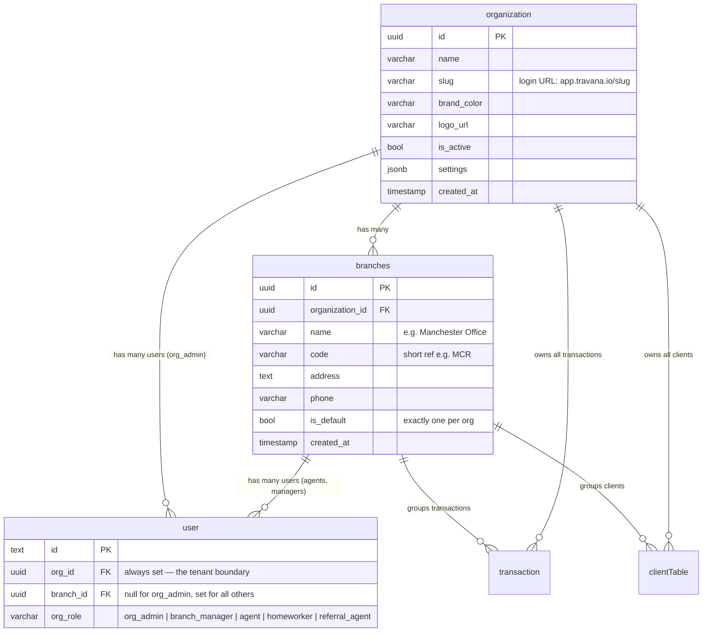
```mermaid
erDiagram
    organization ||--o{ branches : "has many"
    organization ||--o{ user : "has many users (org_admin)"
    branches ||--o{ user : "has many users (agents, managers)"
    branches ||--o{ transaction : "groups transactions"
    branches ||--o{ clientTable : "groups clients"
    organization ||--o{ transaction : "owns all transactions"
    organization ||--o{ clientTable : "owns all clients"

    organization {
        uuid      id       PK
        varchar   name
        varchar   slug             "login URL: app.travana.io/slug"
        varchar   brand_color
        varchar   logo_url
        bool      is_active
        jsonb     settings
        timestamp created_at
    }

    branches {
        uuid      id       PK
        uuid      organization_id  FK
        varchar   name             "e.g. Manchester Office"
        varchar   code             "short ref e.g. MCR"
        text      address
        varchar   phone
        bool      is_default       "exactly one per org"
        timestamp created_at
    }

    user {
        text      id       PK
        uuid      org_id           FK  "always set — the tenant boundary"
        uuid      branch_id        FK  "null for org_admin, set for all others"
        varchar   org_role             "org_admin | branch_manager | agent | homeworker | referral_agent"
    }
```

---

### Org → Branch: One-to-Many

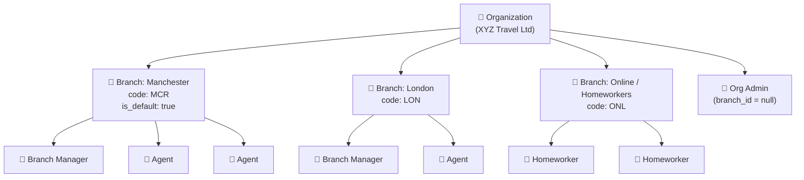
```mermaid
flowchart TD
    ORG["🏢 Organization\n(XYZ Travel Ltd)"]

    ORG --> B1["📍 Branch: Manchester\ncode: MCR\nis_default: true"]
    ORG --> B2["📍 Branch: London\ncode: LON"]
    ORG --> B3["📍 Branch: Online / Homeworkers\ncode: ONL"]

    B1 --> U1["👤 Branch Manager"]
    B1 --> U2["👤 Agent"]
    B1 --> U3["👤 Agent"]

    B2 --> U4["👤 Branch Manager"]
    B2 --> U5["👤 Agent"]

    B3 --> U6["👤 Homeworker"]
    B3 --> U7["👤 Homeworker"]

    ORG --> OA["👑 Org Admin\n(branch_id = null)"]
```

Key rules:
- An org admin sits at org level — `branch_id = null` — and sees across all branches
- Every other user (manager, agent, homeworker) belongs to exactly one branch
- A branch can have zero users (empty branch is valid, e.g. a branch being prepared)
- Deleting a branch does not delete data — records stay, `branch_id` is nullified or reassigned

---

### How Data Flows Through the Hierarchy

Every piece of operational data carries `org_id` (mandatory) and `branch_id` (which branch
created/manages it). The org owns the data; the branch labels it.

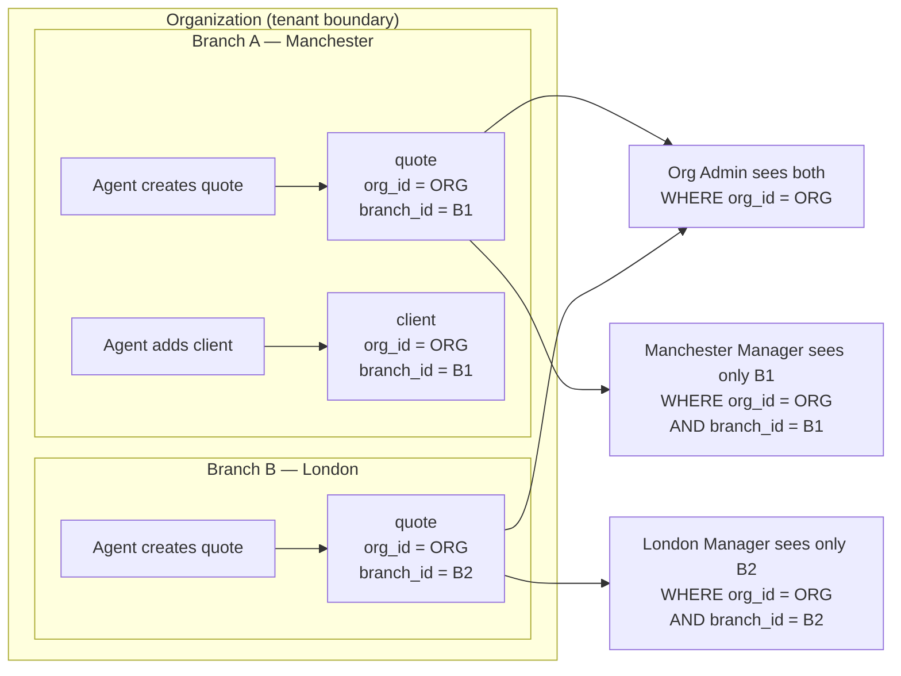
```mermaid
flowchart LR
    subgraph ORG ["Organization (tenant boundary)"]
        direction TB
        subgraph B1 ["Branch A — Manchester"]
            A1["Agent creates quote"] --> Q1["quote\norg_id = ORG\nbranch_id = B1"]
            A2["Agent adds client"] --> C1["client\norg_id = ORG\nbranch_id = B1"]
        end
        subgraph B2 ["Branch B — London"]
            A3["Agent creates quote"] --> Q2["quote\norg_id = ORG\nbranch_id = B2"]
        end
    end

    Q1 --> OA["Org Admin sees both\nWHERE org_id = ORG"]
    Q2 --> OA
    Q1 --> BM1["Manchester Manager sees only B1\nWHERE org_id = ORG\nAND branch_id = B1"]
    Q2 --> BM2["London Manager sees only B2\nWHERE org_id = ORG\nAND branch_id = B2"]
```

---

### Lifecycle: Creating and Managing Branches

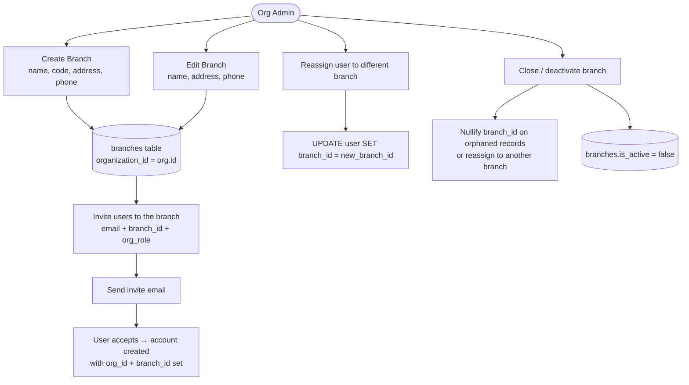
```mermaid
flowchart TD
    OA([Org Admin]) --> CB[Create Branch\nname, code, address, phone]
    CB --> DB[(branches table\norganization_id = org.id)]
    DB --> IU[Invite users to the branch\nemail + branch_id + org_role]
    IU --> SE[Send invite email]
    SE --> UA[User accepts → account created\nwith org_id + branch_id set]

    OA --> EB[Edit Branch\nname, address, phone]
    EB --> DB

    OA --> RB[Reassign user to different branch]
    RB --> UU[UPDATE user SET branch_id = new_branch_id]

    OA --> XB[Close / deactivate branch]
    XB --> NB[Nullify branch_id on orphaned records\nor reassign to another branch]
    XB --> DB2[(branches.is_active = false)]
```

---

### What Org Admin Can Do vs Branch Manager

| Action | Org Admin | Branch Manager |
|---|---|---|
| Create a new branch | ✅ | ❌ |
| Edit any branch details | ✅ | Own branch only |
| Invite user to any branch | ✅ | Own branch only (agent/homeworker roles) |
| Remove user from org | ✅ | ❌ |
| Reassign user to different branch | ✅ | ❌ |
| See all branches' quotes/bookings | ✅ | ❌ — own branch only |
| Cross-branch reports | ✅ | ❌ |
| Edit org branding | ✅ | ❌ |
| Manage billing | ✅ | ❌ |
| Close a branch | ✅ | ❌ |

---

### Branch Rules Summary

| Rule | Detail |
|---|---|
| Minimum branches | Always at least 1 (default branch created at signup) |
| Default branch | Exactly one per org (`is_default = true`) — cannot be deleted |
| User membership | Each non-admin user belongs to exactly one branch |
| Org admin branch | `branch_id = null` — org admin is not tied to any branch |
| Data ownership | Data is owned by the org, labelled with a branch — not owned by the branch |
| Branch deletion | Soft-delete only (`is_active = false`); data stays, users must be reassigned first |
| Cross-branch visibility | Only org admin sees across all branches |

---

## 4. Tables That Get `org_id` + `branch_id`

### Tier 1 — Direct FK columns

Every row carries both `org_id` (the isolation key — always required) and `branch_id` (the grouping
dimension — tells you which branch the record belongs to for filtering and reporting). `org_id` is
what enforces tenant separation. `branch_id` is what enables branch-level views.

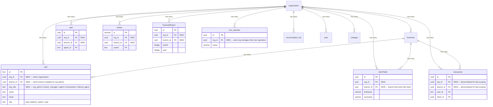
```mermaid
erDiagram
    organization ||--o{ branches : "has many"
    organization ||--o{ user : "has many"
    branches ||--o{ user : "has many"

    organization ||--o{ clientTable : "has many"
    branches ||--o{ clientTable : "has many"

    organization ||--o{ transaction : "has many"
    branches ||--o{ transaction : "has many"

    organization ||--o{ task : "has many"
    organization ||--o{ tickets : "has many"
    organization ||--o{ forwardsReport : "has many"
    organization ||--o{ tour_operator : "has many"
    organization ||--o{ accomodation_list : "has many"
    organization ||--o{ park : "has many"
    organization ||--o{ cottages : "has many"

    user {
        text   id PK
        uuid   org_id      FK  "NEW — which organization"
        uuid   branch_id   FK  "NEW — which branch (nullable for org-admin)"
        text   org_role        "NEW — org_admin | branch_manager | agent | homeworker | referral_agent"
        text   name
        text   email
        text   role            "kept: platform_admin | user"
    }

    clientTable {
        uuid   id PK
        uuid   org_id      FK  "NEW"
        uuid   branch_id   FK  "NEW — branch that owns this client"
        varchar firstName
        varchar surename
    }

    transaction {
        uuid   id PK
        uuid   org_id      FK  "NEW — denormalised for fast scoping"
        uuid   branch_id   FK  "NEW — denormalised for fast scoping"
        text   user_id     FK
        uuid   client_id   FK
    }

    task {
        uuid   id PK
        uuid   org_id      FK  "NEW"
        uuid   branch_id   FK  "NEW"
        text   agent_id    FK
    }

    tickets {
        varchar id PK
        uuid    org_id     FK  "NEW"
        uuid    branch_id  FK  "NEW"
        text    userId     FK
    }

    forwardsReport {
        uuid    id PK
        uuid    org_id     FK  "NEW"
        uuid    branch_id  FK  "NEW"
        integer month
        integer year
    }

    tour_operator {
        uuid    id PK
        uuid    org_id     FK  "NEW — each org manages their own operators"
        varchar name
    }
```

> `accomodation_list`, `park`, `cottages`, and `resorts` are **global shared** — no `org_id` needed.
> Any organization can read them. Only `tour_operator` remains org-scoped because each agency
> manages their own preferred operators and commission rates.

### Tier 2 — Inherited via FK (no direct `org_id`/`branch_id` needed)

Scoped transitively through their parent. No schema change — queries join through parent.


```mermaid
erDiagram
    transaction ||--o{ enquiry_table : "cascade"
    transaction ||--o{ quote : "cascade"
    transaction ||--o{ booking : "cascade"
    transaction ||--o{ notes : "cascade"

    quote ||--o{ travel_deal : "cascade"
    quote ||--o{ quote_flights : "cascade"
    quote ||--o{ quote_accomodation : "cascade"
    quote ||--o{ quote_transfers : "cascade"
    quote ||--o{ quote_car_hire : "cascade"
    quote ||--o{ quote_attraction_ticket : "cascade"
    quote ||--o{ quote_lounge_pass : "cascade"
    quote ||--o{ quote_airport_parking : "cascade"
    quote ||--o{ quote_cruise : "cascade"

    booking ||--o{ booking_flights : "cascade"
    booking ||--o{ booking_accomodation : "cascade"
    booking ||--o{ booking_transfers : "cascade"
    booking ||--o{ booking_car_hire : "cascade"
    booking ||--o{ booking_attraction_ticket : "cascade"
    booking ||--o{ booking_lounge_pass : "cascade"
    booking ||--o{ booking_airport_parking : "cascade"
    booking ||--o{ booking_cruise : "cascade"

    park ||--o{ lodges : "cascade"

    clientTable ||--o{ referral : "cascade"
    clientTable ||--o{ referral_payout : "cascade"
    clientTable ||--o{ referral_withdrawal : "cascade"
    clientTable ||--o{ wallet_transaction : "cascade"
```

### Tier 3 — Global Shared (no change)

Master reference tables shared by all organisations. Managed by platform admin only.
No `org_id` — any organization can read these.

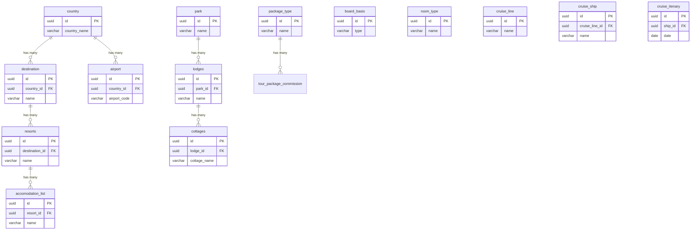
```mermaid
erDiagram
    country ||--o{ destination : "has many"
    destination ||--o{ resorts : "has many"
    resorts ||--o{ accomodation_list : "has many"
    park ||--o{ lodges : "has many"
    lodges ||--o{ cottages : "has many"
    country ||--o{ airport : "has many"
    package_type ||--o{ tour_package_commission : "has many"

    country {
        uuid    id          PK
        varchar country_name
    }
    destination {
        uuid    id          PK
        uuid    country_id  FK
        varchar name
    }
    resorts {
        uuid    id              PK
        uuid    destination_id  FK
        varchar name
    }
    airport {
        uuid    id              PK
        uuid    country_id      FK
        varchar airport_code
    }
    package_type {
        uuid    id   PK
        varchar name
    }
    board_basis {
        uuid    id   PK
        varchar type
    }
    room_type {
        uuid    id   PK
        varchar name
    }
    cruise_line {
        uuid    id   PK
        varchar name
    }
    cruise_ship {
        uuid    id              PK
        uuid    cruise_line_id  FK
        varchar name
    }
    cruise_itenary {
        uuid id      PK
        uuid ship_id FK
        date date
    }
    accomodation_list {
        uuid    id        PK
        uuid    resort_id FK
        varchar name
    }
    park {
        uuid    id   PK
        varchar name
    }
    lodges {
        uuid    id      PK
        uuid    park_id FK
        varchar name
    }
    cottages {
        uuid    id        PK
        uuid    lodge_id  FK
        varchar cottage_name
    }
```

---

## 5. Full Tenancy Map

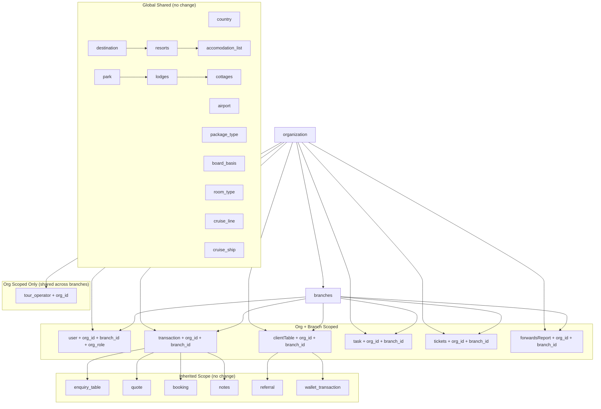
```mermaid
graph TD
    ORG[organization]
    BRN[branches]

    subgraph "Org + Branch Scoped"
        USR[user + org_id + branch_id + org_role]
        CLI[clientTable + org_id + branch_id]
        TXN[transaction + org_id + branch_id]
        TSK[task + org_id + branch_id]
        TKT[tickets + org_id + branch_id]
        FWD[forwardsReport + org_id + branch_id]
    end

    subgraph "Org Scoped Only (shared across branches)"
        TOP[tour_operator + org_id]
    end

    subgraph "Inherited Scope (no change)"
        ENQ[enquiry_table]
        QOT[quote]
        BOK[booking]
        NOT[notes]
        REF[referral]
        WLT[wallet_transaction]
    end

    subgraph "Global Shared (no change)"
        CNT[country]
        DST[destination]
        RST[resorts]
        APT[airport]
        PKG[package_type]
        BBB[board_basis]
        RMT[room_type]
        CRL[cruise_line]
        CRS[cruise_ship]
        ACC[accomodation_list]
        PRK[park]
        LDG[lodges]
        COT[cottages]
    end

    ORG --> BRN
    ORG --> USR
    BRN --> USR
    ORG --> CLI
    BRN --> CLI
    ORG --> TXN
    BRN --> TXN
    ORG --> TSK
    BRN --> TSK
    ORG --> TKT
    BRN --> TKT
    ORG --> FWD
    BRN --> FWD
    ORG --> TOP

    TXN --> ENQ
    TXN --> QOT
    TXN --> BOK
    TXN --> NOT
    DST --> RST
    RST --> ACC
    PRK --> LDG
    LDG --> COT
    CLI --> REF
    CLI --> WLT
```

---

## 6. User Roles & Data Visibility

### Role hierarchy (5 levels)

| Role | Scope | Sees |
|---|---|---|
| `platform_admin` | All orgs | Everything — platform-level super admin |
| `org_admin` | One org | All branches' data, billing, user management |
| `branch_manager` | One branch | Their branch's agents, quotes, bookings, targets |
| `agent` | Self | Own clients, quotes, enquiries |
| `homeworker` | Self | Own clients, quotes, enquiries (same as agent, different context) |
| `referral_agent` | Self | Own referrals + commission status only |

### Two-field role model on `user`

| Column | Values | Purpose |
|---|---|---|
| `role` | `platform_admin`, `user` | Platform-level access gate |
| `org_role` | `org_admin`, `branch_manager`, `agent`, `homeworker`, `referral_agent` | What the user can do inside their org |

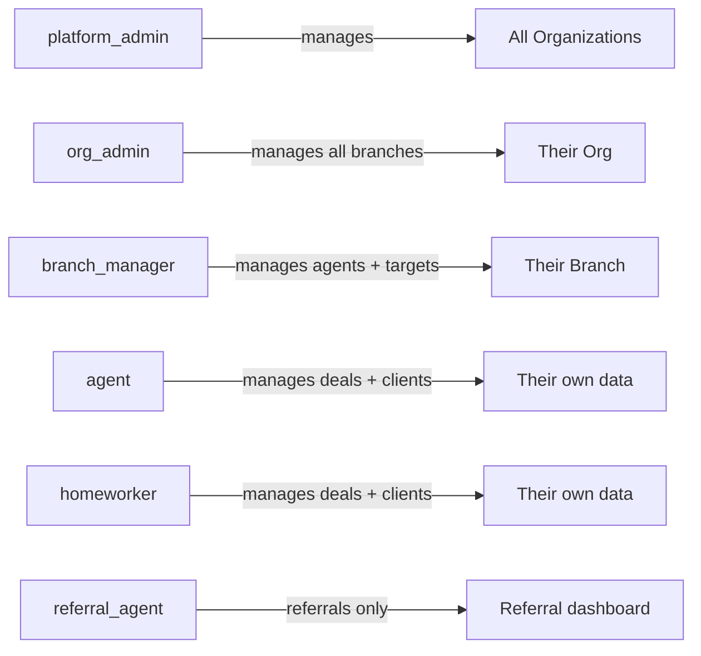
```mermaid
graph LR
    PA[platform_admin] -->|manages| ALL[All Organizations]
    OA[org_admin] -->|manages all branches| ORG[Their Org]
    BM[branch_manager] -->|manages agents + targets| BRN[Their Branch]
    AG[agent] -->|manages deals + clients| SELF[Their own data]
    HW[homeworker] -->|manages deals + clients| SELF2[Their own data]
    RA[referral_agent] -->|referrals only| REF[Referral dashboard]
```

### Data scoping rules per role

`org_id` is always filtered first — it is never optional. `branch_id` and `user_id` are additive
narrowing filters applied on top, depending on the role.

```
platform_admin  → no filter (platform-level access)
org_admin       → WHERE org_id = :orgId                                      ← sees all branches
branch_manager  → WHERE org_id = :orgId AND branch_id = :branchId            ← sees their branch only
agent           → WHERE org_id = :orgId AND user_id = :userId                ← sees own records only
homeworker      → WHERE org_id = :orgId AND user_id = :userId                ← sees own records only
referral_agent  → WHERE org_id = :orgId AND user_id = :userId (referrals only)
```

**The invariant:** No query ever returns data without `org_id` scoping (except `platform_admin`).
`branch_id` is never used as the sole filter — it always sits alongside `org_id`.

---

## 7. Backend Middleware Changes

### Current flow
```
Request → Auth → Controller → Service → Repository
```

### New flow
```
Request → Auth → OrgBranchScope → Controller → Service → Repository(orgId, branchId)
```

The `OrgBranchScope` middleware:
1. Reads the authenticated user's `org_id` and `branch_id` from session
2. Attaches both to `req.orgId` and `req.branchId`
3. Rejects requests from users with no `org_id` (unless `platform_admin`)

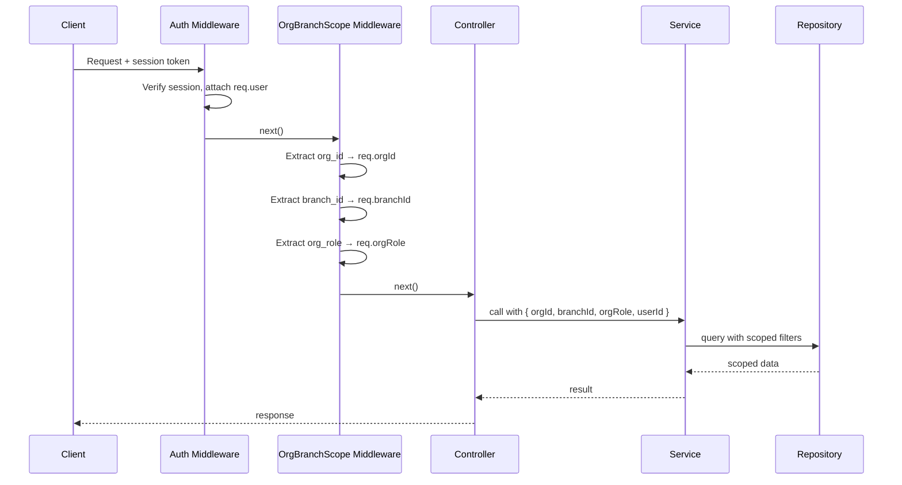
```mermaid
sequenceDiagram
    participant C as Client
    participant A as Auth Middleware
    participant O as OrgBranchScope Middleware
    participant Ctrl as Controller
    participant Svc as Service
    participant Repo as Repository

    C->>A: Request + session token
    A->>A: Verify session, attach req.user
    A->>O: next()
    O->>O: Extract org_id → req.orgId
    O->>O: Extract branch_id → req.branchId
    O->>O: Extract org_role → req.orgRole
    O->>Ctrl: next()
    Ctrl->>Svc: call with { orgId, branchId, orgRole, userId }
    Svc->>Repo: query with scoped filters
    Repo-->>Svc: scoped data
    Svc-->>Ctrl: result
    Ctrl-->>C: response
```

---

## 8. Route Scoping Strategy

| Route group | Scoping | Change needed |
|---|---|---|
| `/api/lookup/*` (countries, destinations, resorts, airports, board-basis, room-types, cruise-*, accommodations, parks, lodges, cottages) | **Global** | None — any org can read |
| `/api/settings/tour-operators` | **Org-scoped** | `org_id` on insert/query |
| `/api/clients`, `/api/transactions`, `/api/quotes`, `/api/bookings` | **Org + Branch scoped** | `WHERE org_id = ? AND branch_id = ?` (branch filtered per role) |
| `/api/users` | **Org-scoped** | Users only see users in their org |
| `/api/branches` | **Org-scoped** | Org admin: CRUD all branches; Branch manager: read own |
| `/api/platform-admin/*` | **Platform admin only** | Guard by `role = platform_admin` |

---

## 9. Branch Management Flow

### How an org admin creates and manages branches

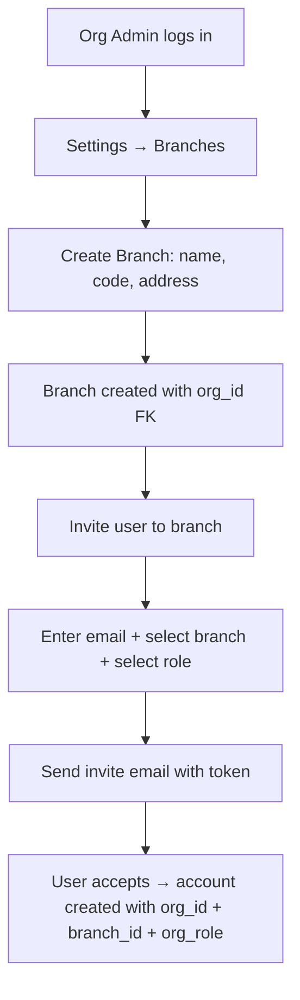
```mermaid
flowchart TD
    A[Org Admin logs in] --> B[Settings → Branches]
    B --> C[Create Branch: name, code, address]
    C --> D[Branch created with org_id FK]
    D --> E[Invite user to branch]
    E --> F[Enter email + select branch + select role]
    F --> G[Send invite email with token]
    G --> H[User accepts → account created with org_id + branch_id + org_role]
```

### Branch invitation rules
- Only `org_admin` can create branches and invite users to any branch
- `branch_manager` can invite `agent` / `homeworker` users to their own branch only
- Users belong to exactly one branch (except `org_admin` who is branch-agnostic)
- Seat limit is counted across the whole org (all branches combined)

---

## 10. `org_id` + `branch_id` Propagation

The service layer always injects scope from the request context — never trust the request body.
`org_id` is mandatory on every insert and every query. `branch_id` is written on insert (the
creating user's branch), and added as a filter on queries only when the role requires it.

```typescript
// INSERT — always write org_id; write branch_id as the creating agent's branch
transactionService.create(data, { orgId, branchId }) {
  return transactionRepository.insert({
    ...data,
    org_id: orgId,     // ← always required — the tenant boundary
    branch_id: branchId, // ← which branch created this record (grouping label)
  });
}

// QUERY as org_admin — org_id only, sees all branches
transactionRepository.findAll({ orgId }) {
  return db.select().from(transaction)
    .where(eq(transaction.org_id, orgId));           // ← org_id is the isolation key
}

// QUERY as branch_manager — org_id first, then narrow by branch
transactionRepository.findAll({ orgId, branchId }) {
  return db.select().from(transaction)
    .where(and(
      eq(transaction.org_id, orgId),                 // ← always first
      eq(transaction.branch_id, branchId),           // ← additional narrowing only
    ));
}

// QUERY as agent — org_id first, then narrow by user
transactionRepository.findAll({ orgId, userId }) {
  return db.select().from(transaction)
    .where(and(
      eq(transaction.org_id, orgId),                 // ← always first
      eq(transaction.user_id, userId),               // ← additional narrowing only
    ));
}
```

**Rule:** `branch_id` is never the only filter. If you remove `org_id` from any query, that is a
security bug. A branch ID alone does not identify a tenant.

---

## 11. Migration Priority Order

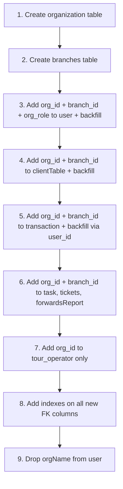
```mermaid
graph TD
    M1[1. Create organization table]
    M2[2. Create branches table]
    M3[3. Add org_id + branch_id + org_role to user + backfill]
    M4[4. Add org_id + branch_id to clientTable + backfill]
    M5[5. Add org_id + branch_id to transaction + backfill via user_id]
    M6[6. Add org_id + branch_id to task, tickets, forwardsReport]
    M7[7. Add org_id to tour_operator only]
    M8[8. Add indexes on all new FK columns]
    M9[9. Drop orgName from user]

    M1 --> M2 --> M3 --> M4 --> M5 --> M6 --> M7 --> M8 --> M9
```

For the initial migration (existing single-tenant data):
1. Create one `organization` row for the current agency
2. Create one default `branch` row for that organization
3. Backfill all `org_id` + `branch_id` with the seed values
4. Then enforce `NOT NULL`

---

## 12. Summary of Schema Changes

| Table | Change |
|---|---|
| **NEW** `organization` | id, name, slug, plan, is_active, seat_limit, brand_color, logo_url, settings, created_at, trial_ends_at |
| **NEW** `branches` | id, organization_id FK, name, code, address, phone, is_default, created_at |
| `user` | Add `org_id FK`, `branch_id FK` (nullable for org_admin), `org_role varchar`, drop `orgName text` |
| `clientTable` | Add `org_id FK NOT NULL`, `branch_id FK NOT NULL` |
| `transaction` | Add `org_id FK NOT NULL`, `branch_id FK NOT NULL` |
| `task` | Add `org_id FK NOT NULL`, `branch_id FK NOT NULL` |
| `tickets` | Add `org_id FK NOT NULL`, `branch_id FK NOT NULL` |
| `forwardsReport` | Add `org_id FK NOT NULL`, `branch_id FK NOT NULL` |
| `tour_operator` | Add `org_id FK NOT NULL` (org-scoped, no branch) |
| `tour_package_commission` | Add `org_id` (inherits from tour_operator but denorm helps) |
| `accomodation_list` | **No change** — global shared |
| `park` | **No change** — global shared |
| `lodges` | **No change** — global shared |
| `cottages` | **No change** — global shared |
| `resorts` | **No change** — global shared |

---

## 13. Data Migration Script (Existing Single-Tenant → Multi-Tenant with Branches)

Safe to run on existing database — every step is additive first, then constrains after backfilling.
Run inside a single transaction so any failure rolls back completely.

```sql
BEGIN;

-- ─── STEP 1: Create the organization table ────────────────────────────────────

CREATE TABLE IF NOT EXISTS organization (
  id             UUID PRIMARY KEY DEFAULT gen_random_uuid(),
  name           VARCHAR NOT NULL,
  slug           VARCHAR NOT NULL UNIQUE,
  plan           VARCHAR NOT NULL DEFAULT 'starter',
  is_active      BOOLEAN NOT NULL DEFAULT true,
  seat_limit     INTEGER NOT NULL DEFAULT 10,
  brand_color    VARCHAR,
  logo_url       VARCHAR,
  settings       JSONB DEFAULT '{}',
  created_at     TIMESTAMP NOT NULL DEFAULT NOW(),
  trial_ends_at  TIMESTAMP
);

-- ─── STEP 2: Create the branches table ───────────────────────────────────────

CREATE TABLE IF NOT EXISTS branches (
  id              UUID PRIMARY KEY DEFAULT gen_random_uuid(),
  organization_id UUID NOT NULL REFERENCES organization(id) ON DELETE CASCADE,
  name            VARCHAR NOT NULL,
  code            VARCHAR,
  address         TEXT,
  phone           VARCHAR,
  is_default      BOOLEAN NOT NULL DEFAULT false,
  created_at      TIMESTAMP NOT NULL DEFAULT NOW()
);

-- ─── STEP 3: Seed the current agency as the first organization ────────────────

INSERT INTO organization (id, name, slug, plan, is_active, seat_limit, brand_color, created_at)
VALUES (
  'aaaaaaaa-0000-0000-0000-000000000001',
  'Softype Travel',                          -- ← replace with real agency name
  'softype',                                 -- ← replace with real slug
  'enterprise',
  true,
  100,
  '#3b82f6',                                 -- ← replace with real brand colour
  NOW()
);

-- ─── STEP 4: Seed the default branch ─────────────────────────────────────────

INSERT INTO branches (id, organization_id, name, code, is_default, created_at)
VALUES (
  'bbbbbbbb-0000-0000-0000-000000000001',
  'aaaaaaaa-0000-0000-0000-000000000001',
  'Main Office',
  'MAIN',
  true,
  NOW()
);

-- Store both IDs for backfill use
DO $$ BEGIN
  PERFORM set_config('app.seed_org_id',    'aaaaaaaa-0000-0000-0000-000000000001', true);
  PERFORM set_config('app.seed_branch_id', 'bbbbbbbb-0000-0000-0000-000000000001', true);
END $$;

-- ─── STEP 5: Add org_id + branch_id columns (nullable first) ─────────────────

ALTER TABLE "user"                      ADD COLUMN IF NOT EXISTS org_id    UUID REFERENCES organization(id);
ALTER TABLE "user"                      ADD COLUMN IF NOT EXISTS branch_id UUID REFERENCES branches(id);
ALTER TABLE "user"                      ADD COLUMN IF NOT EXISTS org_role  VARCHAR DEFAULT 'agent';

ALTER TABLE client_table                ADD COLUMN IF NOT EXISTS org_id    UUID REFERENCES organization(id);
ALTER TABLE client_table                ADD COLUMN IF NOT EXISTS branch_id UUID REFERENCES branches(id);

ALTER TABLE transaction                 ADD COLUMN IF NOT EXISTS org_id    UUID REFERENCES organization(id);
ALTER TABLE transaction                 ADD COLUMN IF NOT EXISTS branch_id UUID REFERENCES branches(id);

ALTER TABLE task                        ADD COLUMN IF NOT EXISTS org_id    UUID REFERENCES organization(id);
ALTER TABLE task                        ADD COLUMN IF NOT EXISTS branch_id UUID REFERENCES branches(id);

ALTER TABLE tickets                     ADD COLUMN IF NOT EXISTS org_id    UUID REFERENCES organization(id);
ALTER TABLE tickets                     ADD COLUMN IF NOT EXISTS branch_id UUID REFERENCES branches(id);

ALTER TABLE forwards_report             ADD COLUMN IF NOT EXISTS org_id    UUID REFERENCES organization(id);
ALTER TABLE forwards_report             ADD COLUMN IF NOT EXISTS branch_id UUID REFERENCES branches(id);

ALTER TABLE tour_operator_table           ADD COLUMN IF NOT EXISTS org_id UUID REFERENCES organization(id);
ALTER TABLE tour_package_commission_table ADD COLUMN IF NOT EXISTS org_id UUID REFERENCES organization(id);
-- accomodation_list, park, lodges, cottages, resorts: NO CHANGE — global shared tables

-- ─── STEP 6: Backfill all columns ────────────────────────────────────────────

UPDATE "user"                    SET org_id = current_setting('app.seed_org_id')::uuid,    branch_id = current_setting('app.seed_branch_id')::uuid WHERE org_id IS NULL;
UPDATE client_table              SET org_id = current_setting('app.seed_org_id')::uuid,    branch_id = current_setting('app.seed_branch_id')::uuid WHERE org_id IS NULL;
UPDATE transaction               SET org_id = current_setting('app.seed_org_id')::uuid,    branch_id = current_setting('app.seed_branch_id')::uuid WHERE org_id IS NULL;
UPDATE task                      SET org_id = current_setting('app.seed_org_id')::uuid,    branch_id = current_setting('app.seed_branch_id')::uuid WHERE org_id IS NULL;
UPDATE tickets                   SET org_id = current_setting('app.seed_org_id')::uuid,    branch_id = current_setting('app.seed_branch_id')::uuid WHERE org_id IS NULL;
UPDATE forwards_report           SET org_id = current_setting('app.seed_org_id')::uuid,    branch_id = current_setting('app.seed_branch_id')::uuid WHERE org_id IS NULL;
UPDATE tour_operator_table           SET org_id = current_setting('app.seed_org_id')::uuid WHERE org_id IS NULL;
UPDATE tour_package_commission_table SET org_id = current_setting('app.seed_org_id')::uuid WHERE org_id IS NULL;

-- ─── STEP 7: Backfill org_role for existing users ────────────────────────────

UPDATE "user"
SET org_role = CASE
  WHEN role = 'admin' THEN 'org_admin'
  WHEN role = 'Manager' THEN 'branch_manager'
  WHEN role = 'Homeworker' THEN 'homeworker'
  WHEN role = 'Referer' THEN 'referral_agent'
  ELSE 'agent'
END
WHERE org_role IS NULL OR org_role = 'agent';

-- ─── STEP 8: Enforce NOT NULL ─────────────────────────────────────────────────

-- org_id is the tenant boundary — always NOT NULL, no exceptions.
-- branch_id is a grouping dimension — NOT NULL in practice (every record is created by a user
-- who belongs to a branch), but stays nullable to accommodate org_admin-created records.

ALTER TABLE "user"                       ALTER COLUMN org_id SET NOT NULL;
-- user.branch_id stays nullable — org_admin users have no branch
ALTER TABLE client_table                 ALTER COLUMN org_id SET NOT NULL;
ALTER TABLE transaction                  ALTER COLUMN org_id SET NOT NULL;
ALTER TABLE task                         ALTER COLUMN org_id SET NOT NULL;
ALTER TABLE tickets                      ALTER COLUMN org_id SET NOT NULL;
ALTER TABLE forwards_report              ALTER COLUMN org_id SET NOT NULL;
ALTER TABLE tour_operator_table           ALTER COLUMN org_id SET NOT NULL;
ALTER TABLE tour_package_commission_table ALTER COLUMN org_id SET NOT NULL;
-- branch_id columns are left nullable (grouping label, not isolation boundary)

-- ─── STEP 9: Add indexes ──────────────────────────────────────────────────────

CREATE INDEX IF NOT EXISTS idx_branches_org_id           ON branches(organization_id);
CREATE INDEX IF NOT EXISTS idx_user_org_id               ON "user"(org_id);
CREATE INDEX IF NOT EXISTS idx_user_branch_id            ON "user"(branch_id);
CREATE INDEX IF NOT EXISTS idx_client_org_id             ON client_table(org_id);
CREATE INDEX IF NOT EXISTS idx_client_branch_id          ON client_table(branch_id);
CREATE INDEX IF NOT EXISTS idx_transaction_org_id        ON transaction(org_id);
CREATE INDEX IF NOT EXISTS idx_transaction_branch_id     ON transaction(branch_id);
CREATE INDEX IF NOT EXISTS idx_task_org_id               ON task(org_id);
CREATE INDEX IF NOT EXISTS idx_task_branch_id            ON task(branch_id);
CREATE INDEX IF NOT EXISTS idx_tickets_org_id            ON tickets(org_id);
CREATE INDEX IF NOT EXISTS idx_tickets_branch_id         ON tickets(branch_id);
CREATE INDEX IF NOT EXISTS idx_forwards_report_org_id    ON forwards_report(org_id);
CREATE INDEX IF NOT EXISTS idx_forwards_report_branch_id ON forwards_report(branch_id);
CREATE INDEX IF NOT EXISTS idx_tour_operator_org_id      ON tour_operator_table(org_id);
-- No indexes needed for accomodation_list, park, lodges, cottages — global tables, no org_id column

-- ─── STEP 10: Drop the now-redundant orgName text column from user ────────────
-- Only safe once org_id is the source of truth and no code reads orgName.

ALTER TABLE "user" DROP COLUMN IF EXISTS "orgName";

-- ─── STEP 11: Verify ─────────────────────────────────────────────────────────

DO $$
DECLARE bad_count INTEGER;
BEGIN
  SELECT COUNT(*) INTO bad_count FROM "user"                   WHERE org_id IS NULL;
  IF bad_count > 0 THEN RAISE EXCEPTION 'user has % rows with NULL org_id', bad_count; END IF;

  SELECT COUNT(*) INTO bad_count FROM client_table             WHERE org_id IS NULL;
  IF bad_count > 0 THEN RAISE EXCEPTION 'client_table has % rows with NULL org_id', bad_count; END IF;

  SELECT COUNT(*) INTO bad_count FROM transaction              WHERE org_id IS NULL;
  IF bad_count > 0 THEN RAISE EXCEPTION 'transaction has % rows with NULL org_id', bad_count; END IF;

  SELECT COUNT(*) INTO bad_count FROM transaction              WHERE branch_id IS NULL;
  IF bad_count > 0 THEN RAISE EXCEPTION 'transaction has % rows with NULL branch_id', bad_count; END IF;

  RAISE NOTICE 'Migration verification passed — all tables fully backfilled.';
END $$;

COMMIT;
```

> **Before running in production:**
> 1. Run against a staging copy of the database first.
> 2. Replace `'Softype Travel'`, `'softype'`, and the brand colour with real values.
> 3. Step 10 (drop `orgName`) can be deferred once confirmed no code reads it.
> 4. Take a full database backup immediately before executing.

---

## 14. Migration Flow Diagram

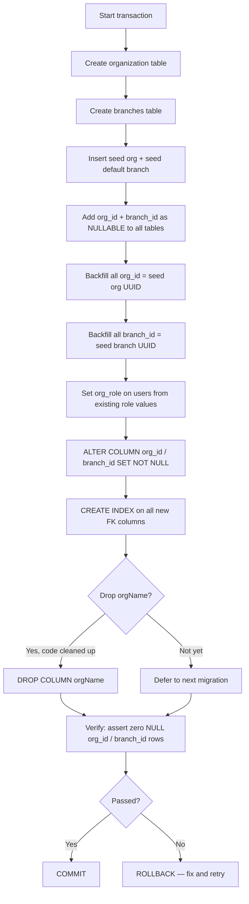
```mermaid
flowchart TD
    A[Start transaction] --> B[Create organization table]
    B --> C[Create branches table]
    C --> D[Insert seed org + seed default branch]
    D --> E[Add org_id + branch_id as NULLABLE to all tables]
    E --> F[Backfill all org_id = seed org UUID]
    F --> G[Backfill all branch_id = seed branch UUID]
    G --> H[Set org_role on users from existing role values]
    H --> I[ALTER COLUMN org_id / branch_id SET NOT NULL]
    I --> J[CREATE INDEX on all new FK columns]
    J --> K{Drop orgName?}
    K -- "Yes, code cleaned up" --> L[DROP COLUMN orgName]
    K -- "Not yet" --> M[Defer to next migration]
    L --> N[Verify: assert zero NULL org_id / branch_id rows]
    M --> N
    N --> O{Passed?}
    O -- Yes --> P[COMMIT]
    O -- No --> Q[ROLLBACK — fix and retry]
```

---

## 15. What Does NOT Change

- The session table (`sessions`) — stays as-is
- All lookup/reference tables: `country`, `destination`, `resorts`, `airport`, `package_type`,
  `board_basis`, `room_type`, `cruise_line`, `cruise_ship`, `cruise_itenary`, `cruise_voyage`,
  `cruise_destination`, `port`, `accomodation_list`, `park`, `lodges`, `cottages`
- All cascade/join tables (`enquiry_*`, `quote_*`, `booking_*`) — scoped implicitly via their parent FK
- The referral and wallet system — scoped implicitly via `client_id → clientTable.org_id`

---

## 16. Organization Onboarding Flow

### Overview

A new agency discovers Travana, signs up, configures their workspace, and goes live. The entire
flow is self-serve. No manual intervention from the platform team is needed for standard signups.

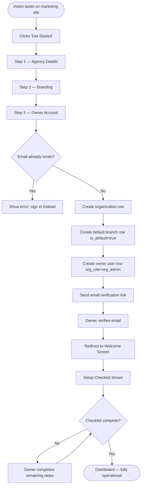
```mermaid
flowchart TD
    A([Visitor lands on marketing site]) --> B[Clicks 'Get Started']
    B --> C[Step 1 — Agency Details]
    C --> D[Step 2 — Branding]
    D --> F[Step 3 — Owner Account]
    F --> G{Email already exists?}
    G -- Yes --> H[Show error: sign in instead]
    G -- No --> I[Create organization row]
    I --> J[Create default branch row is_default=true]
    J --> K[Create owner user row org_role=org_admin]
    K --> L[Send email verification link]
    L --> M[Owner verifies email]
    M --> N[Redirect to Welcome Screen]
    N --> O[Setup Checklist shown]
    O --> P{Checklist complete?}
    P -- No --> Q[Owner completes remaining steps]
    Q --> P
    P -- Yes --> R([Dashboard — fully operational])
```

---

### Step-by-Step Wizard

#### Step 1 — Agency Details

What the user fills in:

| Field | Notes |
|---|---|
| Agency name | Stored as `organization.name` |
| Slug | Auto-generated from name, editable — used for login URL e.g. `app.travana.io/xyz-travel` |
| Country | Sets default locale/currency |
| Phone number | Contact for platform support |

Validation:
- Slug must be unique across all organizations — check live as user types
- Slug: lowercase, alphanumeric + hyphens only, 3–40 chars

---

#### Step 2 — Branding

What the user fills in:

| Field | Notes |
|---|---|
| Logo upload | Stored in object storage, URL saved to `organization.logo_url` |
| Brand colour | Hex picker — saved to `organization.brand_color` |

This is optional — both can be skipped and set later in Settings → Branding.
The app immediately previews the sidebar/header with their logo and colour as they pick.

---

#### Step 3 — Owner Account

What the user fills in:

| Field | Notes |
|---|---|
| First name / Last name | Stored on `user` |
| Email address | Must be unique across all users |
| Password | Minimum 8 chars, hashed before storage |

On submit:
1. Validate all wizard data
2. Create `organization` row (`plan` defaults to `null` until billing is wired)
3. Create `branches` row — name: `"Main Office"`, `is_default: true`, linked to org
4. Create `user` row — `role: "user"`, `org_role: "org_admin"`, `branch_id: null` (org-level)
5. Send verification email with a signed token

---

### Email Verification

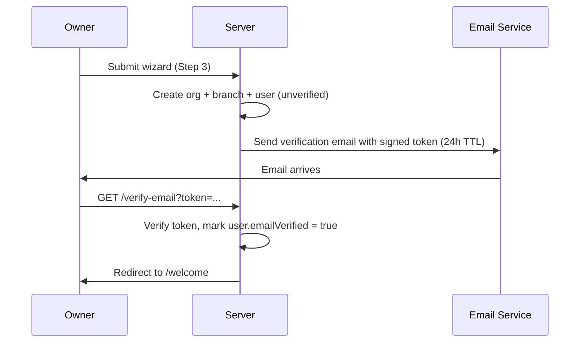
```mermaid
sequenceDiagram
    participant O as Owner
    participant S as Server
    participant E as Email Service

    O->>S: Submit wizard (Step 3)
    S->>S: Create org + branch + user (unverified)
    S->>E: Send verification email with signed token (24h TTL)
    E->>O: Email arrives
    O->>S: GET /verify-email?token=...
    S->>S: Verify token, mark user.emailVerified = true
    S->>O: Redirect to /welcome
```

Unverified accounts:
- Can log in but see a banner: "Please verify your email to unlock all features"
- Cannot invite team members until verified
- Cannot go live (quotes visible to clients) until verified

---

### Welcome Screen & Setup Checklist

After verification, the owner lands on a **Welcome Screen** with a setup checklist.
The dashboard is locked behind the checklist until at least the required steps are done.

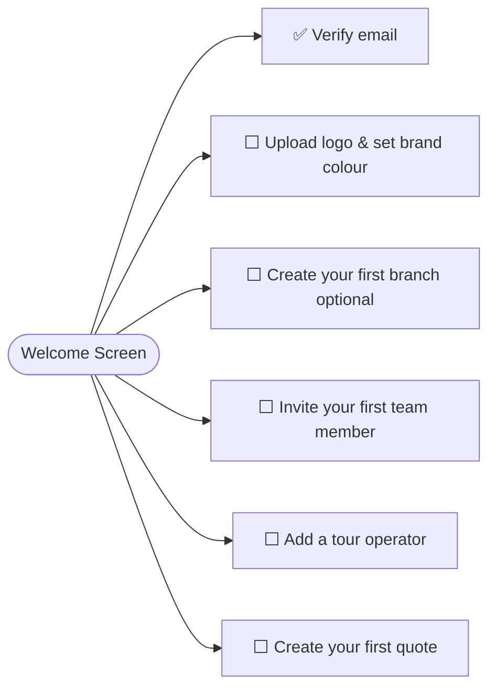
```mermaid
flowchart LR
    WS([Welcome Screen]) --> C1
    WS --> C2
    WS --> C3
    WS --> C4
    WS --> C5
    WS --> C6

    C1[✅ Verify email]
    C2[⬜ Upload logo & set brand colour]
    C3[⬜ Create your first branch optional]
    C4[⬜ Invite your first team member]
    C5[⬜ Add a tour operator]
    C6[⬜ Create your first quote]
```

| Step | Required to unlock dashboard? |
|---|---|
| Verify email | Yes |
| Upload logo / brand colour | No — optional |
| Create a branch | No — default branch already exists |
| Invite a team member | No |
| Add a tour operator | No |
| Create first quote | No |

Once email is verified, the owner can dismiss the checklist and go straight to the dashboard.
Remaining checklist items appear as a collapsible panel in the sidebar until all are done.

---

### What Gets Created on Signup (Database Records)

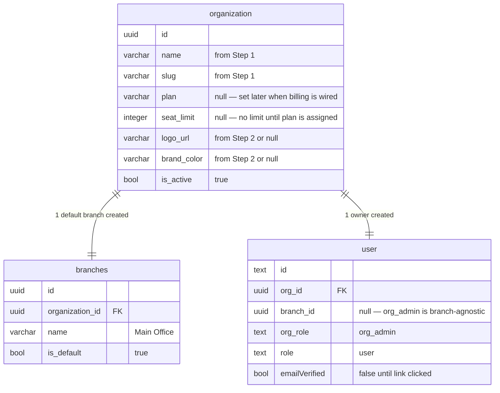
```mermaid
erDiagram
    organization {
        uuid   id
        varchar name        "from Step 1"
        varchar slug        "from Step 1"
        varchar plan        "null — set later when billing is wired"
        integer seat_limit  "null — no limit until plan is assigned"
        varchar logo_url    "from Step 2 or null"
        varchar brand_color "from Step 2 or null"
        bool   is_active    "true"
    }
    branches {
        uuid   id
        uuid   organization_id FK
        varchar name       "Main Office"
        bool   is_default  "true"
    }
    user {
        text   id
        uuid   org_id      FK
        uuid   branch_id   "null — org_admin is branch-agnostic"
        text   org_role    "org_admin"
        text   role        "user"
        bool   emailVerified "false until link clicked"
    }

    organization ||--|| branches : "1 default branch created"
    organization ||--|| user : "1 owner created"
```

---

### Post-Signup: Inviting Team Members

Once the org is live, the owner invites users from **Settings → Team**.

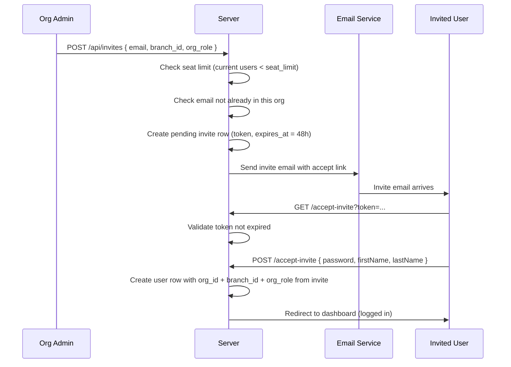
```mermaid
sequenceDiagram
    participant OA as Org Admin
    participant S as Server
    participant E as Email Service
    participant U as Invited User

    OA->>S: POST /api/invites { email, branch_id, org_role }
    S->>S: Check seat limit (current users < seat_limit)
    S->>S: Check email not already in this org
    S->>S: Create pending invite row (token, expires_at = 48h)
    S->>E: Send invite email with accept link
    E->>U: Invite email arrives
    U->>S: GET /accept-invite?token=...
    S->>S: Validate token not expired
    U->>S: POST /accept-invite { password, firstName, lastName }
    S->>S: Create user row with org_id + branch_id + org_role from invite
    S->>U: Redirect to dashboard (logged in)
```

Invite rules:
- `org_admin` can invite to any branch, any role
- `branch_manager` can invite to their own branch only, roles: `agent`, `homeworker`
- Invite token expires in 48 hours — re-send available from the Team page
- Seat limit enforced at invite creation time (not acceptance time)

---

### Platform Admin: Approving / Managing Orgs

Platform admins have a separate area at `/platform-admin` (guarded by `role = platform_admin`).

```mermaid
flowchart TD
    PA([Platform Admin logs in]) --> PAD[Platform Admin Dashboard]
    PAD --> OL[Organizations list]
    OL --> OD[Organization detail]
    OD --> ACT1[Suspend org]
    OD --> ACT2[Reactivate org]
    OD --> ACT3[Change plan / seat limit]
    OD --> ACT4[Impersonate owner for support]
    OD --> ACT5[View all branches]
    OD --> ACT6[View all users]
    OD --> ACT7[Delete org and all data]
```

Impersonation (`ACT4`): Sets a shadow session `{ impersonating: orgId, originalAdmin: adminUserId }`.
All queries run scoped to that org. Exit impersonation returns admin to their own session.

---

## 17. Build Order (Implementation Steps)

1. **Schema + migration** — Create `organization` + `branches` tables; add `org_id`, `branch_id`, `org_role` to all Tier 1 tables (see Section 13)
2. **Auth middleware** — `OrgBranchScope` middleware that injects `req.orgId`, `req.branchId`, `req.orgRole` into every request
3. **Repository layer** — Add `orgId` filter (mandatory) + `branchId` filter (role-dependent) to every list/get/create/update/delete query
4. **Self-serve signup wizard** — 3-step wizard (agency details → branding → owner account) → creates `organization` + default `branch` + owner `user` atomically (see Section 16)
5. **Email verification** — Signed token flow; unverified users see limited UI (see Section 16)
6. **Welcome screen + setup checklist** — Post-signup checklist; dashboard unlocks after email verified (see Section 16)
7. **Branch CRUD API** — `GET/POST/PATCH/DELETE /api/branches` (org admin only — see Section 2)
8. **User invite flow** — Invite by email → org + branch + org_role from invite token → 48h expiry (see Section 16)
9. **Org admin settings UI** — Team tab (invite, remove), Branches tab (see Section 2), Branding tab
10. **Branch manager dashboard** — Cross-agent view scoped to their branch
11. **Org admin dashboard** — Cross-branch reports (quotes, bookings, revenue per branch)
12. **Platform admin area** — All orgs list, suspend/reactivate, plan change, impersonation (see Section 16)
