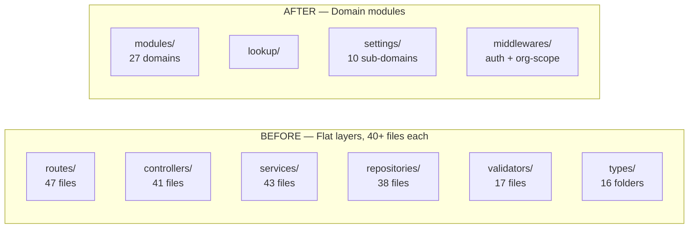
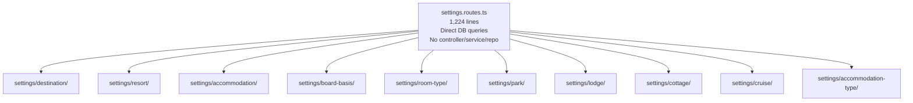
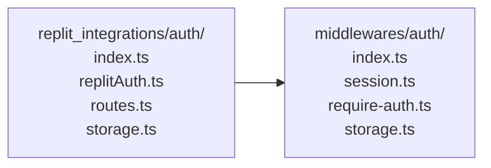
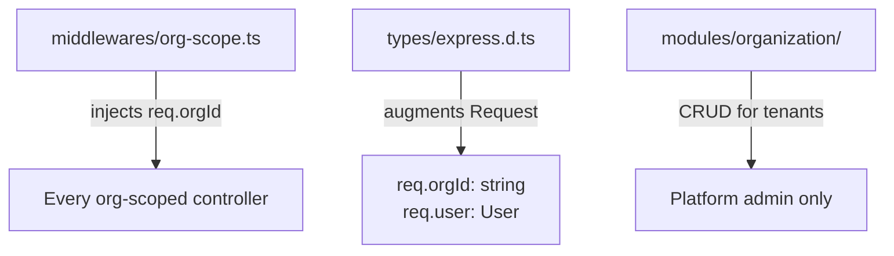
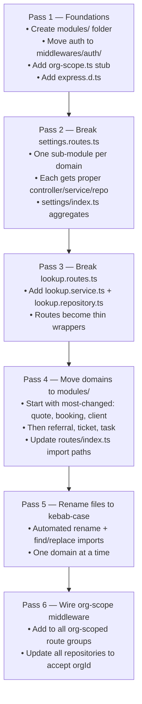

# Server Folder Structure — Refactor Plan

## Current Problems

| Problem | Evidence |
|---------|----------|
| **Flat layer folders** — 40+ files in one folder, no domain grouping | `routes/` has 47 files, `controllers/` has 41 files |
| **`settings.routes.ts` is a 1,224-line monolith** with direct DB queries — violates every layer rule | Destinations, resorts, accommodations, tour operators, board basis, room types, parks, lodges, cruises all crammed in one file |
| **`lookup.routes.ts` also has inline DB queries** | 271 lines, no controller/service/repository |
| **Inconsistent naming** | `neonClient.routes.ts` vs `destination-guru.routes.ts` vs `social-post.routes.ts` |
| **Auth buried in `replit_integrations/`** | Should be `middlewares/auth/` — framework-agnostic name |
| **No `app.ts` / `server.ts` split** | `index.ts` does everything |
| **`vite.ts`, `static.ts` loose at root** | No clear home |
| **No `middlewares/org-scope`** | Needed for SaaS — doesn't exist yet |
| **`hubPost`, `hr`, `audit`, `feedback`** | Have routes but incomplete layer stacks |

---

## Recommended Structure: Domain Modules

Group all files for one domain together instead of grouping by technical layer.
Each domain owns its routes, controller, service, repository, validator, and types.

```
server/
│
├── app.ts                  ← Express app setup, middleware registration
├── server.ts               ← HTTP server bind + port
├── static.ts               ← Static file serving (unchanged)
├── vite.ts                 ← Vite dev proxy (unchanged)
│
├── config/
│   ├── database.ts
│   └── s3.ts
│
├── middlewares/
│   ├── auth/
│   │   ├── index.ts        ← re-exports
│   │   ├── session.ts      ← session config (moved from replit_integrations)
│   │   └── require-auth.ts ← requireAuth guard
│   ├── org-scope.ts        ← NEW: injects req.orgId from req.user.org_id
│   ├── error.middleware.ts
│   └── validation.middleware.ts
│
├── utils/
│   ├── async-handler.ts
│   ├── encryption.ts
│   ├── error-handler.ts
│   ├── get-user-id.ts
│   ├── only-socials.ts
│   └── response.ts
│
├── types/
│   └── express.d.ts        ← Augment Express Request: req.orgId, req.user
│
│
├── modules/                ← All domain code lives here
│   │
│   │── organization/       ← NEW (SaaS tenant management)
│   │   ├── organization.routes.ts
│   │   ├── organization.controller.ts
│   │   ├── organization.service.ts
│   │   ├── organization.repository.ts
│   │   ├── organization.validator.ts
│   │   └── organization.types.ts
│   │
│   ├── user/
│   │   ├── user.routes.ts
│   │   ├── user.controller.ts
│   │   ├── user.service.ts
│   │   ├── user.repository.ts
│   │   ├── user.validator.ts
│   │   └── user.types.ts
│   │
│   ├── client/
│   │   ├── client.routes.ts
│   │   ├── client.controller.ts
│   │   ├── client.service.ts
│   │   ├── client.repository.ts
│   │   ├── client.validator.ts
│   │   └── client.types.ts
│   │
│   ├── transaction/
│   │   ├── transaction.routes.ts
│   │   ├── transaction.controller.ts
│   │   ├── transaction.service.ts
│   │   ├── transaction.repository.ts
│   │   └── transaction.types.ts
│   │
│   ├── enquiry/
│   │   ├── enquiry.routes.ts
│   │   ├── enquiry.controller.ts
│   │   ├── enquiry.service.ts
│   │   ├── enquiry.repository.ts
│   │   ├── enquiry.validator.ts
│   │   └── enquiry.types.ts
│   │
│   ├── quote/
│   │   ├── quote.routes.ts
│   │   ├── quote.controller.ts
│   │   ├── quote.service.ts
│   │   ├── quote.repository.ts
│   │   ├── quote.validator.ts
│   │   ├── quote.types.ts
│   │   ├── quote-image.controller.ts   ← sub-feature of quote
│   │   ├── quote-image.service.ts
│   │   ├── quote-image.repository.ts
│   │   ├── quote-public.controller.ts  ← public token-based access
│   │   ├── quote-public.service.ts
│   │   └── quote-public.repository.ts
│   │
│   ├── booking/
│   │   ├── booking.routes.ts
│   │   ├── booking.controller.ts
│   │   ├── booking.service.ts
│   │   ├── booking.repository.ts
│   │   └── booking.types.ts
│   │
│   ├── referral/
│   │   ├── referral.routes.ts
│   │   ├── referral.controller.ts
│   │   ├── referral.service.ts
│   │   ├── referral.repository.ts
│   │   ├── referral.validator.ts
│   │   ├── referralPayout.controller.ts
│   │   ├── referralPayout.service.ts
│   │   ├── referralPayout.repository.ts
│   │   ├── referralWithdrawal.controller.ts
│   │   ├── referralWithdrawal.service.ts
│   │   └── referralWithdrawal.repository.ts
│   │
│   ├── wallet/
│   │   ├── wallet.routes.ts
│   │   ├── wallet.controller.ts
│   │   ├── wallet.service.ts
│   │   └── wallet.repository.ts
│   │
│   ├── ticket/
│   │   ├── ticket.routes.ts
│   │   ├── ticket.controller.ts
│   │   ├── ticket.service.ts
│   │   ├── ticket.repository.ts
│   │   ├── ticket.validator.ts
│   │   ├── ticketReply.controller.ts
│   │   ├── ticketReply.service.ts
│   │   ├── ticketReply.repository.ts
│   │   ├── ticketAttachment.controller.ts
│   │   ├── ticketAttachment.service.ts
│   │   └── ticketAttachment.repository.ts
│   │
│   ├── task/
│   │   ├── task.routes.ts
│   │   ├── task.controller.ts
│   │   ├── task.service.ts
│   │   └── task.repository.ts
│   │
│   ├── note/
│   │   ├── note.routes.ts
│   │   ├── note.controller.ts
│   │   ├── note.service.ts
│   │   └── note.repository.ts
│   │
│   ├── notification/
│   │   ├── notification.routes.ts
│   │   ├── notification.controller.ts
│   │   ├── notification.service.ts
│   │   └── notification.repository.ts
│   │
│   ├── dashboard/
│   │   ├── dashboard.routes.ts
│   │   ├── dashboard.controller.ts
│   │   ├── dashboard.service.ts
│   │   └── dashboard.repository.ts
│   │
│   ├── revenue/
│   │   ├── revenue.routes.ts
│   │   ├── revenue.controller.ts
│   │   ├── revenue.service.ts
│   │   └── revenue.repository.ts
│   │
│   ├── targets/
│   │   ├── targets.routes.ts
│   │   ├── targets.controller.ts
│   │   ├── targets.service.ts
│   │   └── targets.repository.ts
│   │
│   ├── social-post/
│   │   ├── social-post.routes.ts
│   │   ├── social-post.controller.ts
│   │   ├── social-post.service.ts
│   │   └── social-post.repository.ts
│   │
│   ├── chat/
│   │   ├── chat.routes.ts
│   │   ├── chat.controller.ts
│   │   ├── chat.service.ts
│   │   └── chat.repository.ts
│   │
│   ├── email/
│   │   ├── email.routes.ts
│   │   ├── email.controller.ts
│   │   ├── email.service.ts
│   │   └── email.repository.ts
│   │
│   ├── sms/
│   │   ├── sms.routes.ts
│   │   ├── sms.controller.ts
│   │   ├── sms.service.ts
│   │   └── sms.repository.ts
│   │
│   ├── facebook/
│   │   ├── facebook.routes.ts
│   │   ├── facebook.controller.ts
│   │   ├── facebook.service.ts
│   │   └── facebook.repository.ts
│   │
│   ├── search/
│   │   ├── search.routes.ts
│   │   ├── search.controller.ts
│   │   ├── search.service.ts
│   │   └── search.repository.ts
│   │
│   ├── tag/
│   │   ├── tag.routes.ts
│   │   ├── tag.controller.ts
│   │   ├── tag.service.ts
│   │   └── tag.repository.ts
│   │
│   ├── favorite/
│   │   ├── favorite.routes.ts
│   │   ├── favorite.controller.ts
│   │   ├── favorite.service.ts
│   │   └── favorite.repository.ts
│   │
│   ├── airport/
│   │   ├── airport.routes.ts
│   │   ├── airport.controller.ts
│   │   ├── airport.service.ts
│   │   ├── airport.repository.ts
│   │   └── airport.validator.ts
│   │
│   ├── tour-operator/          ← renamed from tourOperator (kebab-case)
│   │   ├── tour-operator.routes.ts
│   │   ├── tour-operator.controller.ts
│   │   ├── tour-operator.service.ts
│   │   ├── tour-operator.repository.ts
│   │   └── tour-operator.validator.ts
│   │
│   ├── registration/
│   │   ├── registration.routes.ts
│   │   ├── registration.controller.ts
│   │   ├── registration.service.ts
│   │   └── registration.repository.ts
│   │
│   ├── portal/
│   │   ├── portal.routes.ts
│   │   ├── portal.controller.ts
│   │   └── portal.service.ts
│   │
│   └── opportunities/
│       ├── opportunities.routes.ts
│       ├── opportunities.controller.ts
│       ├── opportunities.service.ts
│       └── opportunities.repository.ts
│
│
├── lookup/                     ← Global shared reference data (no org scope)
│   ├── lookup.routes.ts        ← Keep as route-only (data is read-only, simple)
│   ├── lookup.service.ts       ← Move DB queries here from routes
│   └── lookup.repository.ts
│
│
└── settings/                   ← Break the 1,224-line monolith into sub-modules
    ├── index.ts                ← Combines all settings sub-routers
    ├── destination/
    │   ├── destination.routes.ts
    │   ├── destination.controller.ts
    │   ├── destination.service.ts
    │   └── destination.repository.ts
    ├── resort/
    │   ├── resort.routes.ts
    │   ├── resort.controller.ts
    │   ├── resort.service.ts
    │   └── resort.repository.ts
    ├── accommodation/
    │   ├── accommodation.routes.ts
    │   ├── accommodation.controller.ts
    │   ├── accommodation.service.ts
    │   └── accommodation.repository.ts
    ├── board-basis/
    │   └── ...
    ├── room-type/
    │   └── ...
    ├── park/
    │   └── ...
    ├── lodge/
    │   └── ...
    ├── cottage/
    │   └── ...
    └── cruise/
        └── ...                 ← cruise-line, ship, itinerary
```

---

## Problem Visualised: Before vs After



---

## The `settings.routes.ts` Breakdown

This single 1,224-line file contains inline DB queries for 10 different domains. Each needs its own module.



---

## Naming Convention (Standardise to kebab-case)

| Current | Fixed |
|---------|-------|
| `neonClient.routes.ts` | `neon-client.routes.ts` |
| `tourOperator.routes.ts` | `tour-operator.routes.ts` |
| `clientFile.routes.ts` | `client-file.routes.ts` |
| `ticketAttachment.routes.ts` | `ticket-attachment.routes.ts` |
| `ticketReply.routes.ts` | `ticket-reply.routes.ts` |
| `referralPayout.routes.ts` | `referral-payout.routes.ts` |
| `referralWithdrawal.routes.ts` | `referral-withdrawal.routes.ts` |
| `hubPost.routes.ts` | `hub-post.routes.ts` |
| `adminImport.routes.ts` | `admin-import.routes.ts` |

Rule: **all files use kebab-case**. No camelCase filenames anywhere.

---

## Auth Middleware Rename



`replitAuth.ts` → `session.ts` — removes the Replit-specific name. When you swap auth providers for SaaS,
only this file changes, nothing else.

---

## New SaaS-Required Files



### `middlewares/org-scope.ts`
```typescript
// Pseudocode — not to implement yet, just the shape
export function orgScope(req, res, next) {
  const orgId = req.user?.org_id;
  if (!orgId) return res.status(403).json({ message: 'No org context' });
  req.orgId = orgId;
  next();
}
```

### `types/express.d.ts`
```typescript
// Extends Express globally — one place, all routes benefit
declare namespace Express {
  interface Request {
    orgId: string;
    user?: import('../shared/schema').User;
  }
}
```

---

## Migration Priority

Don't move everything at once. Do it in passes:



> **Each pass is independently deployable** — the app stays working throughout.
> Never do a "big bang" rename of everything at once.

---

## Summary Table

| Issue | Fix |
|-------|-----|
| 1,224-line `settings.routes.ts` with inline DB queries | Break into 10 sub-modules under `settings/` |
| 271-line `lookup.routes.ts` with inline DB queries | Add `lookup.service.ts` + `lookup.repository.ts` |
| 47-file flat `routes/` folder | Move to `modules/<domain>/` |
| Auth in `replit_integrations/` | Move to `middlewares/auth/` |
| No org-scope middleware | Add `middlewares/org-scope.ts` |
| No Express type augmentation | Add `types/express.d.ts` |
| Mixed camelCase/kebab-case filenames | Standardise to kebab-case |
| No `app.ts` / `server.ts` split | Split `index.ts` into `app.ts` + `server.ts` |
