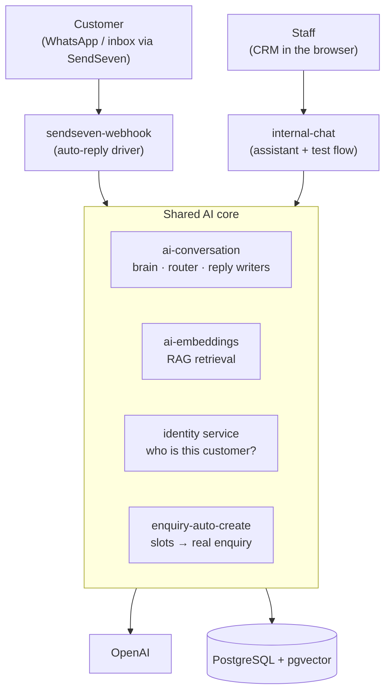
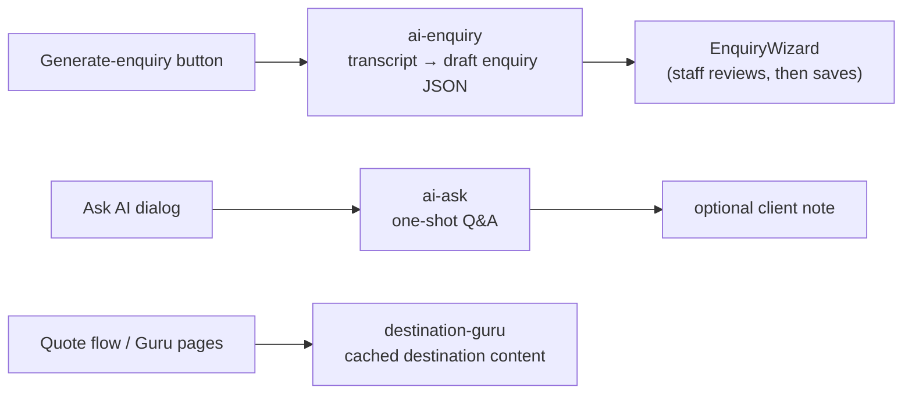
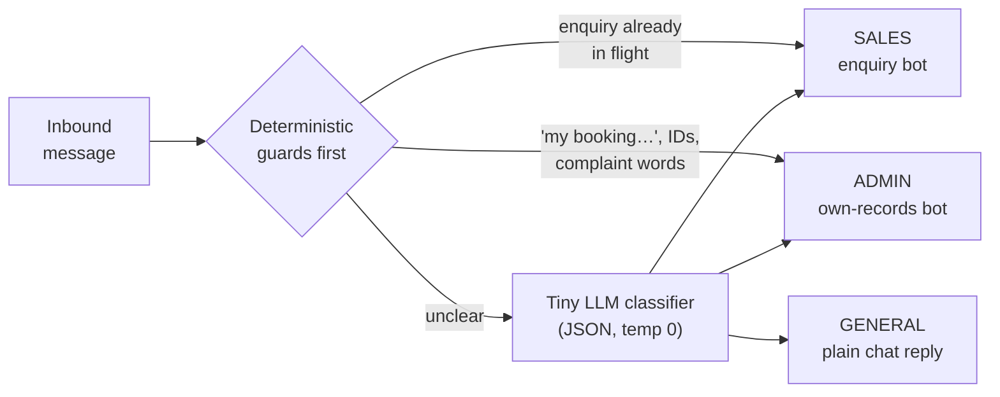
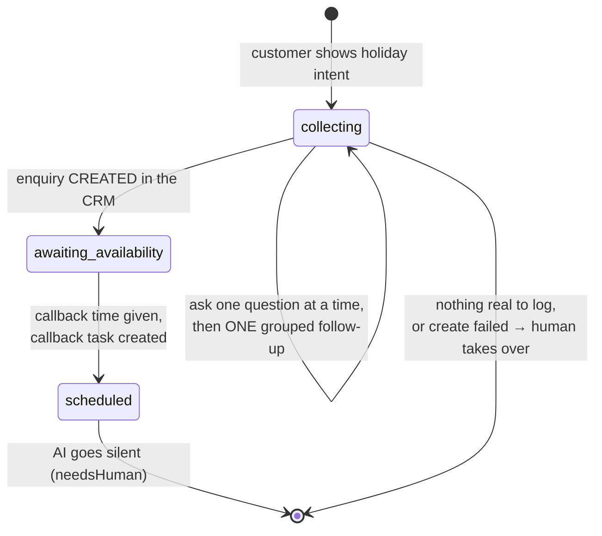
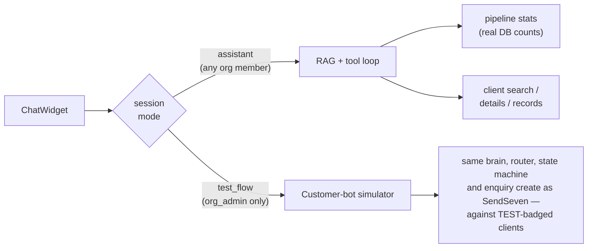
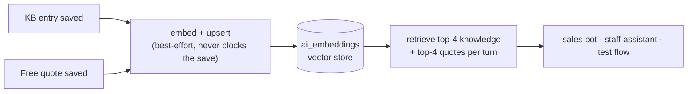
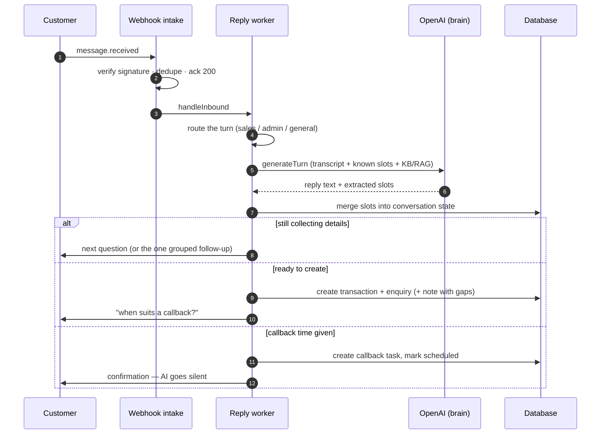

# AI Architecture — Current State

> Documentation of the AI subsystem as it exists today, after the structure/optimization
> refactor. Covers every AI-touching module under `server/v2/`, the shared "brain",
> the RAG/vector layer, and the client entry points.

---

## 1. High-level overview

The system has **four user-facing AI surfaces** that all converge on a small set of
shared internals:

| Surface | Audience | Entry point | Module |
|---|---|---|---|
| SendSeven auto-reply (WhatsApp/inbox bot) | Customers | `POST /sendseven-webhook/:orgId` | `sendseven-webhook` |
| Internal chat widget (assistant + test flow) | Staff | `POST /internal-chat/sessions/:id/messages` | `internal-chat` |
| "Generate enquiry (AI)" from a conversation | Staff | `POST /ai-enquiry/from-conversation` | `ai-enquiry` |
| Ask AI dialog (one-shot travel Q&A) | Staff | `POST /ai/ask` | `ai-ask` |

Plus one content-generation service: **destination-guru** (destination intelligence
library, generated on demand from the quote flow).

**Shared internals** (no routes of their own — libraries consumed by the drivers):

- `ai-conversation/` — the driver-agnostic **brain**: enquiry slot-filling prompt +
  `generateTurn`, the upper-level **conversation router** (sales/admin/general), and
  org-voice reply generators (`generateGeneralReply`, `generateGroupedAsk`,
  `generateTransitionReply`, `generateBeneficiaryAsk`, `generateTicketConfirmation`),
  plus KB helpers (`audienceAllows`, `buildRulesBlock`, `buildStyleExamplesBlock`).
- `ai-embeddings/` — pgvector RAG store (`ai_embeddings` table) with `syncSource` /
  `retrieve`.
- `sendseven-webhook/identity.service.ts` — shared client identity resolution
  (contact links, phone matching, phone-conflict detection), reused by the internal
  test flow via `internal-chat-identity.service.ts`.
- `sendseven-webhook/enquiry-auto-create.service.ts` — resolves collected free-text
  slots to lookup IDs and creates the enquiry (used by both conversational drivers).

The picture to keep in mind: **two conversational drivers share one AI core**;
the other services are simple one-shot calls.

The simple one-shot services sit beside this, each a single OpenAI call:

Per-org configuration (**bot-config** persona/rules + **knowledge-base** entries)
feeds every prompt the core builds — see §6 for how each bot filters it.

---

## 2. Models & OpenAI usage

Model selection is centralized in [`server/v2/utils/ai-model.ts`](../server/v2/utils/ai-model.ts):

| Constant | Value | Used by |
|---|---|---|
| `CHAT_MODEL` | `OPENAI_CHAT_MODEL` env, default **`gpt-4.1`** | Enquiry brain (`generateTurn`), conversation router, all org-voice generators, admin-agent, internal-chat assistant, ai-enquiry |
| `EMBEDDING_MODEL` | `EMBEDDING_MODEL` env, default **`text-embedding-3-small`** (1536 dims) | `ai-embeddings` via `utils/embeddings.ts` |
| *(hardcoded)* `gpt-4o` | — | `ai-ask.service.ts` and `destination-guru.service.ts` **bypass `CHAT_MODEL`** (known inconsistency) |

`CHAT_MODEL` must support JSON mode, tool calling, and `temperature` (o-series models
are explicitly unsuitable). There is no shared OpenAI client singleton — each module
constructs its own via a local `getOpenAI()`; the brain's instance is exported and
reused by admin-agent and the router.

---

## 3. SendSeven auto-reply pipeline (customer-facing)

### 3.1 Webhook intake

`sendseven-webhook.controller` → `sendseven-webhook.service`:

1. **Verification handshake** — `X-Sendseven-Event: verification` echoes the
   challenge with HTTP 200, no signature required.
2. **Signature check** — HMAC-SHA256 over `${timestamp}.${rawBody}`, 5-minute replay
   window, timing-safe compare. Stale timestamps are acked silently; bad signatures
   get 401.
3. **Dedupe** — events recorded idempotently in `sendseven_webhook_events`;
   duplicates are dropped.
4. **Ack-then-process** — the controller returns 200 immediately, then processes
   fire-and-forget (AI turns can exceed SendSeven's ack timeout).
5. **Event routing** — `message.received` (inbound) → `replyWorker.handleInbound`;
   outbound messages not sent by us, or agent assignment → human takeover
   (`setNeedsHuman`, AI goes silent).

Auto-reply mode is per-org (`sendseven_integrations.autoReplyMode`): **`draft`**
(AI reply saved as a draft for staff) or **`send`** (AI replies directly).

### 3.2 Turn processing — the three-bot router

Every inbound customer message is routed to exactly one bot **before** any bot runs:

- **general** — greetings/small talk/agency questions. No slot-filling and no
  name+phone onboarding demand.
- **admin** — a verified existing customer dealing with records they already have.
- **sales** — new holiday interest → the enquiry slot-filling state machine.
- `context.domain` persists as a *hint* (sticky for genuine admin follow-ups) but a
  clear new-holiday message can always recover to sales — a single misroute never
  traps the conversation.

### 3.3 Sales route — enquiry state machine

The reply worker (`reply-worker.service.ts`) drives a per-conversation state machine
persisted in `sendseven_conversation_state`. The brain (`generateTurn`) extracts
slots each turn; the **code**, not the model, decides transitions. Slots are merged
server-side (`mergeSlots`) so a terse reply never loses earlier-captured fields.

How the `collecting → created` step decides to fire: once the customer has given
at least one substantive detail, the bot sends **one** grouped follow-up listing
whatever's still missing; the *next* reply triggers creation regardless of gaps
(anything unanswered lands in the enquiry note). A customer who front-loads
everything skips the follow-up and the enquiry is created immediately.

Key properties:

- **Onboarding gate** — unknown contacts are asked for name + phone first; identity
  resolution (`identity.service.ts`) auto-links to an existing client by phone/email,
  detects **phone conflicts** (number on file under a different name → ask to
  confirm), and supports **on-behalf enquiries** (beneficiary: the enquiry is filed
  under the traveller, not the sender).
- **Creation is data-driven** — fires on collected slots, not the model's intent
  label (the model routinely flips to `intent="other"` while wrapping up).
- **Atomic claims** — `claimStatusTransition` guards enquiry creation and callback
  task creation against webhook retries / concurrent inbounds.
- **Fail-honest** — a failed create resets state and hands off to a human instead of
  telling the customer it was logged.
- Holiday types: **Package Holiday** (default), **Cruise Package**, **Hot Tub
  Break** — each with its own field checklist driving the grouped ask and the
  "fields still needed" note.

### 3.4 Slot → enquiry resolution

`enquiry-auto-create.resolveAndCreateEnquiry()` (shared by both drivers):

- Resolves free text → lookup IDs: holiday type (`package_type_table`), destinations,
  resorts (adds the resort's destination too), departure airports (code or name),
  board basis (constrained to the canonical wizard set).
- Values it can't map (cruise line, accommodation type, unknown destinations, vague
  dates, non-standard star ratings) go into the enquiry **note** — never dropped,
  never inserted raw.
- Coercion guards: budget parsing ("£1,100 per person" → `1100` + `Per Person`),
  strict `YYYY-MM-DD` for the date column, int coercion for nights/pax.
- Creates via `transactionService.createTransactionWithEnquiry` under a **system
  scope** owned by the org's default owner (an active org_admin, else any active
  member). `is_test` tags test-flow records.

### 3.5 Admin route — the admin agent

`admin-agent.service.ts` is a tool-calling bot for **verified existing clients**
about their own data only:

- Tools: `get_my_quotes`, `get_my_enquiries`, `get_my_tickets`, `get_my_files`,
  `get_my_file_link`, `open_ticket`. Every executor closes over the server-resolved
  `(orgId, clientId)` — the model never supplies identity.
- **Fail-closed disclosure** (`admin-data.service.ts` projects customer-safe shapes):
  no commission/margin/discount/internal costs, no other customers' data; the
  customer's own quote status/dates/price is fine.
- **Ticket backstop** — if the model *claims* it logged/raised something but never
  called `open_ticket`, the worker forces a `tool_choice: open_ticket` call, then
  renders a confirmation in the org's voice. Tickets land in the `ticket` table
  (default owner, type Admin, Open/Medium) with any message attachments.

---

## 4. Internal chat (staff-facing widget)

One module, two modes, dispatched in `internal-chat.service.postMessage`:

**Assistant mode** highlights:

- Answers are grounded in real DB numbers via tools — the model never invents
  counts; arithmetic (conversion rates, period windows) happens in code.
- Permissions are **fail-closed and resolved server-side** per caller scope: agents
  see only their own clients/pipeline; branch/org scoping by role.
- Session memory: resolved clients (`{id, name}`, max 10) are cached on
  `session.context` so follow-up questions reuse exact UUIDs instead of re-searching.
- Prompt rules forbid collecting enquiries (that's the customer bot's job) and
  leaking contact details.

**Test flow mode** is a faithful driver of the customer-facing enquiry machinery —
same brain, same router, same state machine, same enquiry creation — against
synthetic clients tagged with a `TEST` badge. Sessions are one-shot: once an enquiry
is logged / handed off, the tester starts a fresh session.

---

## 5. RAG / vector layer

- Source types: **`knowledge`** (KB entries) and **`quote`** (free quotes). There is
  deliberately **no mass vectorization** of other entities.
- Sync is best-effort and non-awaited — an embedding failure never breaks a KB save
  or quote save. Backfills are manual scripts, not cron.
- Retrieval is org-scoped, cosine similarity, and gated: the reply worker only
  retrieves KB when the static KB exceeds its prompt budget, and quotes only on
  enquiry-ish turns. Retrieved quotes are **internal reference only** — prompts
  forbid quoting prices/availability from them.

---

## 6. Per-org configuration: bot-config & knowledge-base

**`bot-config`** (`org_bot_config`, one row per org; org_admin-managed): bot name,
avatar, persona, preferred response style, greeting, sign-off, language (`en-GB`
default), hand-off instructions, and a **rules list** — up to 50 entries of
`{ text, audience: general|sales|admin, isActive }`. Also surfaces auto-reply status
(`enabled`, `mode: draft|send`, provisioned) and enable/disable/mode endpoints that
manage the SendSeven webhook registration.

**`knowledge-base`** (`org_knowledge_base`): entries with `title`, `content`,
`category`, `audience` (`general` default), `isActive`. Saved entries sync to the
vector store automatically.

**How the three prompt builders consume them** (via shared brain helpers):

| Consumer | Rules/KB audience filter | Style examples |
|---|---|---|
| Sales brain (`generateTurn`, general replies) | `general` + `sales` | Yes — voice only, facts explicitly untrusted |
| Admin agent | `general` + `admin` | Yes |
| Internal assistant | `general` only | Yes |

KB categories like `tone`, `style`, `conversation example` are treated as **style
examples** — they teach *how* the bot talks, and prompts explicitly forbid treating
their holidays/prices/numbers as facts.

---

## 7. Supporting AI services

### ai-enquiry — "Generate enquiry (AI)" from a conversation
Staff-triggered from the inbox (linked contacts only). `fromTranscript()` sends the
conversation (last 24k chars) to `CHAT_MODEL` in JSON mode and returns a
Zod-validated `EnquiryIntent` (free-text fields, safe defaults). **No DB writes** —
the client resolves names → lookup IDs and pre-fills the EnquiryWizard; the staff
member reviews and saves.

### ai-ask — one-shot Q&A
`POST /ai/ask` → a single `gpt-4o` completion (travel-agent persona), optionally
saved to a client's notes via `POST /ai/ask/save`. Mounted with authentication but
no org scope.

### destination-guru — destination intelligence library
Global (cross-org) content: best time to visit, flight times, monthly temperatures,
must-dos, etc. Generated on demand by `gpt-4o` (validated: 12 monthly temps,
non-empty must-do list), cached in its own table, auto-triggered from the quote flow
(`resolveAndGenerateGuru`) and browsable from its own pages.

---

## 8. Data model (AI-owned tables)

| Table | Purpose |
|---|---|
| `sendseven_conversation_state` | Per-conversation memory for the auto-reply: `intent`, `enquirySlots` (jsonb), `enquiryStatus`, `enquiryId`, `needsHuman`, `context` (jsonb: `domain`, `groupedAskSent`, `beneficiary`, `lastReply`…), `lastAiReplyAt` |
| `sendseven_webhook_events` | Idempotent webhook event log (dedupe) |
| `sendseven_contact_links` | 1:1 org-scoped link between a SendSeven contact and a CRM client |
| `internal_chat_session` | Staff chat sessions — `mode` (`assistant`/`test_flow`), mirrors the enquiry state shape so the same machinery runs in test mode |
| `internal_chat_message` | Messages per session (`user`/`assistant`/`system_note`) |
| `ai_embeddings` | pgvector store (see §5) |
| `org_bot_config` | Per-org bot persona + rules (see §6) |
| `org_knowledge_base` | Audience-tagged knowledge entries (see §6) |

---

## 9. End-to-end: one auto-reply turn, step by step

What actually happens when a customer message arrives (sales route shown — the
most involved path):

The admin route swaps steps 5–6 for the admin agent's tool loop (own quotes /
enquiries / tickets / files, `open_ticket`), and the general route is a single
persona-grounded reply with no state change.

---

## 10. Design principles worth preserving

1. **One brain, many drivers.** The enquiry bot's prompt, slot logic, and state
   machine live once in `ai-conversation` + shared services; SendSeven and the test
   flow are thin drivers. Fixes land in both surfaces automatically.
2. **Code decides, the model words it.** State transitions, enquiry creation, ticket
   creation, and routing short-circuits are deterministic; the LLM only extracts
   slots and generates wording (including the org-voice transition/grouped-ask
   replies).
3. **Fail-closed permissions.** Every tool executor resolves identity and scope
   server-side; the model can neither name a client ID it wasn't given nor widen its
   scope.
4. **Fail-honest customer messaging.** Failed creates hand off to a human; claimed
   actions are backstopped (forced `open_ticket`); atomic claims prevent duplicate
   side-effects on webhook retries.
5. **Nothing is silently dropped.** Unmappable slot values go into enquiry notes;
   vague dates are preserved verbatim rather than coerced.

### Known inconsistencies / follow-ups

- `ai-ask` and `destination-guru` hardcode `gpt-4o` instead of using `CHAT_MODEL`.
- OpenAI client construction is duplicated per module (no shared singleton).
- Cruise slot capture depends on the model using the canonical `destinations` /
  `holidayType` keys; there is currently **no defensive slot sanitizer** remapping
  invented keys (e.g. `cruiseDestination`) — see the cruise enquiry investigation.
